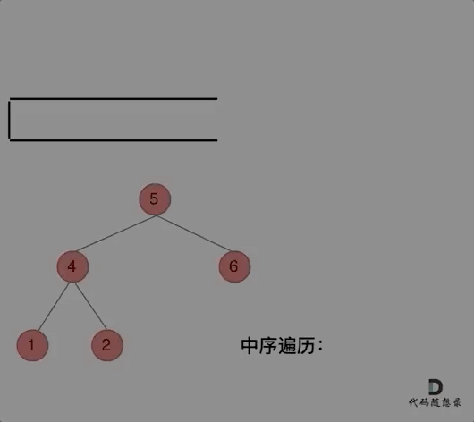

# 1. 数组

## 1. 二分查找

### 704. 二分查找（简单）

**题目：**

给定一个 `n` 个元素有序的（升序）整型数组 `nums`和一个目标值 `target` ，写一个函数搜索 `nums` 中的 `target`，如果目标值存在返回下标，否则返回 `-1`。

```c++
class Solution {
public:
    int search(vector<int>& nums, int target) {
        int right = nums.size() - 1;  // 右边界初始化
        int left = 0;  // 左边界初始化

        while (left <= right)
        {
            int mid = left + ((right - left) / 2);
            if (nums[mid] < target)  // 目标值在右半边
            {
                left = mid + 1;
            }
            else if (nums[mid] > target)  // 目标值在左半边
            {
                right = mid - 1;  // 如果是左闭右开，这里就不用-1
            }
            else  // 找到目标值
            {
                return mid;
            }
        }
        
        return -1;  // 未找到目标值
    }
};
```


### 34. 在排序数组中查找元素的第一个和最后一个位置（中等）

**题目：**

给你一个按照非递减顺序排列的整数数组 `nums`，和一个目标值`target`。请你找出给定目标值在数组中的开始位置和结束位置。

如果数组中不存在目标值 `target`，返回 `[-1, -1]`。

你必须设计并实现时间复杂度为 `O(log n)` 的算法解决此问题。


参考链接：[link](https://leetcode.cn/problems/find-first-and-last-position-of-element-in-sorted-array/solution/ru-he-ba-yi-dao-er-fen-fa-gei-mian-shi-g-yzcc/)

```c++
class Solution {
public:
    vector<int> searchRange(vector<int>& nums, int target) {
        return {searchLeftOrRightBound(nums, target, "left"), searchLeftOrRightBound(nums, target, "right")};
    }
private:
    int searchLeftOrRightBound(vector<int>& nums, int target, const string& bound)
    {
        int left = 0;
        int right = nums.size() - 1;
        int res = -1;

        while (left <= right)
        {
            int mid = left + ((right - left) >> 1);
            if (nums[mid] < target)  // target在右边的区间里，且肯定不是mid索引的元素，所以+1操作
            {
                left = mid + 1;  // [left, right] --> [mid + 1, right]
            }
            else if (nums[mid] > target)  // target在左边的区间里，且肯定不是mid索引的元素，所以-1操作
            {
                right = mid - 1;  // [left, right] -->[left, mid - 1]
            }
            else  // 第三种情况  nums[mid] == target
            {
                res = mid;  // 记录一下mid
                if (bound == "left")  // 如果是找做target第一个元素，则nums[mid] == target的情况下，第一个元素如果不是mid，那肯定在左边
                {
                    right = mid -1;  // 所以这里就更新一下右区间
                }
                else if (bound == "right")  // 如果是找做target最后一个元素，则nums[mid] == target的情况下，最后一个元素如果不是mid，那肯定在右边
                {
                    left = mid + 1;  // 所以这里就更新一下左区间
                }
                else
                {
                    // 异常处理段
                    cout << "传入正确边界参数" << endl;
                    break;
                }
            }
        }

        return res;
    }
};
```


### 69. x 的平方根 （简单）

给你一个非负整数 `x `，计算并返回 `x `的 算术平方根 。

由于返回类型是整数，结果只保留 **整数部分** ，小数部分将被 **舍去** 。

注意：不允许使用任何内置指数函数和算符，例如 `pow(x, 0.5)` 或者 `x ** 0.5` 。


参考链接：[link](https://leetcode.cn/problems/sqrtx/solution/x-de-ping-fang-gen-by-s1amduncan-74hw/)

```c++
class Solution {
public:
    int mySqrt(int x) {
        int left = 0;
        int right = x;
        int result = 0;
        
        // 1. mid的平方小于x，那么有可能就是result，也有可能不是；
        // 2. mid的平方大于x，那么肯定不是result，就继续往小的猜，令right = mid - 1；
		// 3. mid的平方刚好等于x，那么再经过边界更新就不满足left <= right了。
        while (left 那么可不可以 以一种统一的逻辑来移除 链表的节<= right)
        {
            int mid = left + ((right - left) / 2);
            if ((long)mid * mid <= x)  // 强转成long类型，因为这里可能会超出int的范围
            {
                result = mid;  // 直接给result赋值,然后如果后续还能进行二分，即left <= right，就继续更新
                left = mid + 1;  // 所需的数在有半边
            }
            else  // 所需要的数在左半边
            {
                right = mid - 1;
            }
        }

        return result;  // 返回结果
    }
};
```


## 2. 移除元素

### 27. 移除元素（简单）

双指针思路：[link](https://www.bilibili.com/video/BV12A4y1Z7LP/?vd_source=ff498e5dc05e7bbe6be82c1d9e17f9fa)

快指针用来寻找新数组所需的元素，即除了需要删除的元素之外的所有元素；

慢指针用来记录新数组所需的元素。


```c++
class Solution {
public:
    int removeElement(vector<int>& nums, int val) {
        int slowIndex = 0;
        int size = nums.size();
        for (int fastIndex = 0; fastIndex < size; fastIndex++)
        {
            if (nums[fastIndex] != val)  // 寻找并不需要删除的元素
            {
                nums[slowIndex] = nums[fastIndex];  // 记录不需要删除的元素
                slowIndex++;  // 慢指针后移一位
            }
        }
        return slowIndex;  // 最后返回的slowIndex就是新数组的长度
    }
};
```


### 26. 删除有序数组中的重复项（简单）

参考链接：[link](https://leetcode.cn/problems/remove-duplicates-from-sorted-array/solution/shuang-zhi-zhen-shan-chu-zhong-fu-xiang-dai-you-hu/)

```c++
class Solution {
public:
    int removeDuplicates(vector<int>& nums) {
        int slowIndex = 0;
        int size = nums.size();

        if (size == 0) return 0;  // 判断nums是否为空
        
        // 1.如果快慢指针索引的元素相等，则快指针向后移一位，即fastIndex++操作
        // 2.如果快慢指针索引的元素不相等，则在慢指针后一位记录快指针索引的元素，即nums[++slowIndex] == nums[fastIndex]

        for (int fastIndex = 1; fastIndex < size; fastIndex++)  // 快指针初始化为1
        {
            if (nums[slowIndex] != nums[fastIndex])  // 找到非重复项
            {
                nums[++slowIndex] = nums[fastIndex];  // 在slowIndex + 1处 记录fastIndex索引的元素
            }
        }

        return slowIndex + 1  // 这里不好理解，可以举个极端的例子，例如nums是全为1的vector，最后删除重复项之后就只剩1个元素，没有非重复项，slowIndex就是0,所以要+1
    }
};
```


### 283. 移动零（简单）

参考链接：[link](https://leetcode.cn/problems/move-zeroes/solution/dong-hua-yan-shi-283yi-dong-ling-by-wang_ni_ma/)

```c++
class Solution {
public:
    void moveZeroes(vector<int>& nums) {
        int slowIndex = 0, size = nums.size();
        if (size == 0)  // 判断是否为空
        {
            return;
        }

        for (int fastIndex = 0; fastIndex < size; fastIndex++)
        {
            if (nums[fastIndex] != 0)  // 寻找不等于0的元素
            {
                // 1.先用slowIndex去记录不等于0的元素
                // 2.slowIndex++
                nums[slowIndex++] = nums[fastIndex];
            }

            // 如果找到等于0的元素，只进行fastIndex++
        }

        for (; slowIndex < size; slowIndex++)  // 对于slowIndex后面的元素都赋值为0
        {
            nums[slowIndex] = 0;
        }
    }
};
```


## 3. 有序数组的平方

### 977. 有序数组的平方（简单）

```c++
class Solution {
public:
    vector<int> sortedSquares(vector<int>& nums) {
        int k = nums.size() - 1;  // 数组的索引，为长度-1
        // int k = nums.size();  // 也可以写成这样
        vector<int> result(nums.size(), 0);  // 创建个等长的全为0的新数组
        // vector<int> result(k, 0);

        // 比较nums[i] * nums[i]和nums[j] * nums[j]大小，哪个大就记录哪个
        // 然后把记录的那个元素的索引进行更新（i++或者j--），还有result的索引也更新（k--）
        for(int i = 0, j = k; i <= j;)
        // for (int i = 0, j = k - 1; i <= j)
        {
            if (nums[i] * nums[i] < nums[j] * nums[j])
            {
                // 1.j索引的数平方之后更大，就记录它并更新j
                result[k--] = nums[j] * nums[j];  // 先对result[k]进行赋值，然后k--
                // result[--k] = nums[j] * nums[j];  // 先更新k（--k），然后赋值
                j--;
            }
            else
            {
                // 2.i索引的数平方之后更大
                result[k--] = nums[i] * nums[i];
                // result[--k] = nums[i] * nums[i];  // 先更新k（--k），然后赋值
                i++;
            }
        }
        
        return result;
    }
};
```


## 4. 长度最小的子数组

### 209. 长度最小的子数组（中等）

**暴力解法：**

```c++
class Solution {
public:
    int minSubArrayLen(int target, vector<int>& nums) {
        int size = nums.size();
        if (size == 0) return 0;

        int result = INT32_MAX;  // 初始化result为最大值
        for (int i = 0; i < size; i++)
        {
            int sum = 0;  // 子序列之和
            int subLength = 0;  // 子数组的长度
            for (int j = i; j < size; j++)
            {
                sum += nums[j];
                if (sum >= target)
                {
                    subLength = j - i + 1;  // 计算子数组的长度
                    result = result < subLength ? result : subLength;
                    break;  // 当前i符合条件的最短子数组已经找到了，跳出内层for循环
                }
            }
        }

        return result == INT32_MAX ? 0 : result;
    }
};
```

暴力解法是可以完成这个操作的，但力扣上提交会超时。


**移动窗口**

思路：

1. 先找到满足子序列之和大于等于目标值
2. 再从起始位置缩小子序列


```c++
class Solution {
public:
    int minSubArrayLen(int target, vector<int>& nums) {
        int size = nums.size();
        int result = INT_MAX;
        int subSum = 0;
        int subLength = 0;

        int slowPoint = 0;  // 定义一个慢指针
        int fastPoint = 0;  // 定义一个快指针

        for (; fastPoint < size; fastPoint++)
        {
            subSum += nums[fastPoint];
            // 根据当前子序列的和大小，不断调节子序列的起始位置
            while (subSum >= target)
            {
                subLength = fastPoint - slowPoint + 1;
                result = result < subLength ? result : subLength;

                // 利用慢指针让连续的子序列从头开始减少一位（-=）
                // 然后对慢指针进行后移（slowPoint++）

                // 一旦子序列减少到subSum小于target，即题目条件不满足时，就停止
                subSum -= nums[slowPoint++];
            }
        }
        return result == INT_MAX ? 0 : result;
    }
};
```


## 5. 螺旋矩阵II

### 59.螺旋矩阵II（中等）

给你一个正整数 `n` ，生成一个包含 `1`到 `n^2` 所有元素，且元素按顺时针顺序螺旋排列的 `n x n` 正方形矩阵 `matrix` 。

示例1：


**解题思路：**

1. 填充上边
2. 填充右边
3. 填充下边
4. 填充左边

每次填充都是按顺序的左闭右开

左闭右开的判断，可以参考这个图，尤其是理解下边和左边遍历的时候：


#### 解决方法

```c++
class Solution {
public:
    vector<vector<int>> generateMatrix(int n) {
        vector<vector<int>> result(n, vector<int>(n, 0));  // 初始化一个二维数组
        int startX = 0, startY = 0;  // 定义每次循环一圈的起始位置，最开始是(0, 0)
        int mid = n / 2;  // 定义矩阵的中间索引，例如n = 3，则中间元素索引就是(1, 1)
        int loop = n / 2;  // 定义需要循环的圈数，配合if (n % 2)来判断n是否是奇数，即是否需要填最中间的值
        int count = 1;  // 定义一个初始化为1的元素，用来往数组插值，大小就是1～n^2
        int offset = 1;  // 定义一个用来控制每条边（循环一圈需要填4条边）遍历长度的变量，每循环一圈之后就+1
        int i, j;

        while (loop --)  // loop即循环次数，每循环一次就进行-1操作
        {
            // 先给循环使用的变量i, j赋值
            i = startX, j = startY;

            // 模拟示例1中的 循环填充元素
            // for循环不变量均设置成左闭右开
            
            // 1.遍历上边
            for (; j < n - offset; j++)  // n - offset 就是上边需要遍历的次数，例如，n = 5，第一圈就遍历4次， 第二圈就需要遍历3次
            {
                // 横坐标是不变的，都是startX
                result[startX][j] = count++;  // 再赋值之后，对count进行+1操作
            }

            // 2.遍历右边
            for (; i < n - offset; i++)  // 同样的，n - offset 就是右边需要遍历的次数
            {
                // 纵坐标是不变的，都是j，即经过上边遍历之后的j，例如n = 3时，上边遍历之后就变成j = 2了
                result[i][j] = count++;  // 一样赋值之后，再+1
            }

            // 3.遍历下边
            for (; j > startY; j--)  // j为变量，经过之前的for循环，已经变成了n - offset
            // 例如：循环第一圈的(startX, startY)为(0, 0)，那么j > startY，即从n - offset 到 0，左闭右开
            {
                result[i][j] = count++;
            }

            // 4.遍历左边
            for (; i > startX; i--)  // i为变量，经过之前的for循环，已经变成n - offset
            {
                result[i][startY] = count++;  // 其实这里的startY和j是一样的，遍历上边中的startX和i也是一样的
            }

            // 遍历完一圈之后，更新一些记录变量
            // 首先，更新起始位置
            startX++;
            startY++;

            // 其次，更新控制遍历长度的变量
            offset++;
        }

        // 循环完外边之后，如果n是奇数，那么就还需要添加最后一个数到最中间
        if (n % 2)  // 判断n是否是奇数，如果n除于2有余，那么就是奇数，执行添加
        {
            result[mid][mid] = count;  // count经过前面的while循环，已经是n^2了
        }


        // 返回这个矩阵
        return result;
    }
};
```


### 54. 螺旋矩阵（中等）

给你一个 `m` 行 `n` 列的矩阵 `matrix` ，请按照顺时针螺旋顺序 ，返回矩阵中的所有元素。


参考链接：[link](https://leetcode.cn/problems/spiral-matrix/solution/cxiang-xi-ti-jie-by-youlookdeliciousc-3/)

**解题思路：**

1. 首先定义上下左右边界，for循环采用左闭右闭
2. 先向右移动遍历到最右边，此时第一行已经遍历过了，可以将其在矩阵中删去，想象成m行变成m-1行，体现在代码里就是更新上边界
3. 判断在重新定义上边界之后，上下边界是否交错（因为边界采取的是左闭右闭，所以可以相等），如果交错，则遍历结束，跳出while循环
4. 如果不交错，则遍历还未结束，接下来依次：向下、向左、向上，完成遍历，步骤类似与第2步和第3步
5. 不断while循环，直到有两条边界交错，就break掉

#### 解决方法

```c++
class Solution {
public:
    vector<int> spiralOrder(vector<vector<int>>& matrix) {
        vector<int> result;  // 初始化一个返回容器
        if (matrix.empty()) return result;  // 如果为空直接返回初始化容器

        // 定义边界变量
        int leftBoundary = 0;
        int rightBoundary = matrix[0].size() - 1;  // 右边界即列数-1,因为下面for循环用的是<=，即左闭右闭
        int upperBoundary = 0;
        int lowerBoundary = matrix.size() - 1;  // 下边界即行数-1

        // 开始循环返回
        while (true)
        {
            for (int i = leftBoundary; i <= rightBoundary; i++)  // 向右移动，依次遍历
            {
                result.push_back(matrix[upperBoundary][i]);
            }
            if (++upperBoundary > lowerBoundary) break;  // 重新定义了上边界，若上边界大于下边界，则遍历完成，下同

            for (int i = upperBoundary; i <= lowerBoundary; i++)  // 向下移动，以此遍历
            {
                result.push_back(matrix[i][rightBoundary]);
            }
            if (--rightBoundary < leftBoundary) break;  // 重新定义右边界，进行减1，如果右边界小于左边界，则break

            for (int i = rightBoundary; i >= leftBoundary; i--)  // 向左移动
            {
                result.push_back(matrix[lowerBoundary][i]);
            }
            if (--lowerBoundary < upperBoundary) break;  // 重新定义下边界，进行减1,如果小于上边界，则break

            for (int i = lowerBoundary; i >= upperBoundary; i--)
            {
                result.push_back(matrix[i][leftBoundary]);  // 向上移动
            }
            if (++leftBoundary > rightBoundary) break;  // 重新定义左边界，进行+1,如果大于有边界，则break
        }

        return result;

    }
};
```


# 2. 链表

## 1. 移除链表元素

### 203. 移除链表元素（简单）

**题目：**

给你一个链表的头节点` head` 和一个整数 `val` ，请你删除链表中所有满足 `Node.val == val `的节点，并返回 新的头节点 。


1. 在没有虚拟头节点的链表里删除满足条件的节点

因为节点删除需要找到其前一个节点，故分为两种情况

a. 需要删除的是头节点

b. 需要删除的是非头节点

2. 设置虚拟头节点，统一删除

#### 解决方法1

参考链接：[link](https://programmercarl.com/0203.%E7%A7%BB%E9%99%A4%E9%93%BE%E8%A1%A8%E5%85%83%E7%B4%A0.html#%E5%85%B6%E4%BB%96%E8%AF%AD%E8%A8%80%E7%89%88%E6%9C%AC)

```c++
/**
 * Definition for singly-linked list.
 * struct ListNode {
 *     int val;
 *     ListNode *next;
 *     ListNode() : val(0), next(nullptr) {}
 *     ListNode(int x) : val(x), next(nullptr) {}
 *     ListNode(int x, ListNode *next) : val(x), next(next) {}
 * };
 */
class Solution {
public:
    ListNode* removeElements(ListNode* head, int val) {
        // 删除头节点
        while (head != NULL && head->val == val)
        {
            ListNode* pDel = head;  // 缓存要删除的节点
            head = head->next;  // 将头节点新设置成下一个节点
            delete pDel;  // 删除原来的头节点
        }

        // 删除非头节点
        // 定义一个辅助指针变量
        ListNode* pCurrent = head;
        while (pCurrent != NULL && pCurrent->next != NULL)  // 一直遍历到最后一个节点
        {
            // 找到需要删除的节点的前一个节点
            if (pCurrent->next->val == val)
            {
                ListNode* pDel = pCurrent->next;
                pCurrent->next = pCurrent->next->next;  // 直接让前一个节点跳过需要删除的节点，指向下一个节点
                delete pDel;  // 释放内存
            }
            else
            {
                // 如果不是需要删除的节点，那么就让辅助指针变量后移
                pCurrent = pCurrent->next;
            }
        }

        // 返回头节点
        return head;
    }
};
```


#### 解决方法2

```c++
/**
 * Definition for singly-linked list.
 * struct ListNode {
 *     int val;
 *     ListNode *next;
 *     ListNode() : val(0), next(nullptr) {}
 *     ListNode(int x) : val(x), next(nullptr) {}
 *     ListNode(int x, ListNode *next) : val(x), next(next) {}
 * };
 */
class Solution {
public:
    ListNode* removeElements(ListNode* head, int val) {
        // 设置一个虚拟头节点
        ListNode* dummyHead = new ListNode(0);  // 设置一个虚拟头节点
        // 将虚拟头节点的next指向真实头节点
        dummyHead->next = head;

        // 定义一个辅助指针，让他指向虚拟头节点
        ListNode* pCurrent = dummyHead;

        while (pCurrent->next != NULL)  // 辅助指针从虚拟头节点开始，一直到最后一个节点，循环
        {
            if (pCurrent->next->val == val)
            {
                ListNode* pDel = pCurrent->next;
                pCurrent->next = pCurrent->next->next;
                delete pDel;
            }
            else
            {
                pCurrent = pCurrent->next;  // 非所需删除的节点，辅助指针向后移动
            }
        }

        head = dummyHead->next;  // 将新列表的头节点进行赋值
        delete dummyHead;  // 释放内存
        return head;  // 返回结果
    }
};
```


## 2. 设计链表

### 707.设计链表（中等）

参考链接：[link](https://leetcode.cn/problems/design-linked-list/solution/by-linken_54-7moa/)


```c++
```


## 3. 翻转链表 

### 206. 反转链表（简单）


#### 双指针法


```c++
class Solution {
public:
    ListNode* reverseList(ListNode* head) {
        ListNode* pCurrent = head;  // 定义一个快指针  初始化为头节点
        ListNode* pNull = NULL;  // 定义一个慢指针  初始化为NULL

        while (pCurrent != NULL)
        {
            // 1.保存好当前pCurrent->next指向的节点，因为重新给pCurrent->next指向之后，就没办法利用pCurrent->next找到这个节点了
            ListNode* pTemp = pCurrent->next;

            // 2.重新给pCurrent->next指向  指向NULL
            pCurrent->next = pNull;

            // 3.重新给pCurrent 和 pNull赋值
            pNull = pCurrent;  // 慢指针当前的节点
            pCurrent = pTemp;  // 快指针指向保存好的下一个节点
        }
        // 最后pCurrent指向原来的尾部NULL，pNull指向反转后的头节点
        return pNull;
    }
};
```


#### 虚拟头节点法

```c++
class Solution {
public:
    ListNode* reverseList(ListNode* head) {
        // 创建虚拟头节点
        ListNode* dummyHead = new ListNode();
        
        // 遍历所有节点
        ListNode* pCurrent = head;

        while (pCurrent != NULL)
        {
            // 记录pCurrent的下一个节点
            ListNode* pTemp = pCurrent->next;

            // 头插法
            pCurrent->next = dummyHead->next;  // 将原本的头节点的next指向null
            dummyHead->next = pCurrent;  // 将dummyHead的next指向原本的头节点
            pCurrent = pTemp;  // 更新辅助指针，为下一个节点
        }

        return dummyHead->next;  // 返回虚拟头节点的下一个节点，也就是新头节点
    }
};
```


## 4. 两两交换链表中的节点

### 24. 两两交换链表中的节点（中等）

**题目：**

给定一个链表，两两交换其中相邻的节点，并返回交换后的链表。

你不能只是单纯的改变节点内部的值，而是需要实际的进行节点交换。

**解题参考：**

[代码随想录](https://www.programmercarl.com/0024.%E4%B8%A4%E4%B8%A4%E4%BA%A4%E6%8D%A2%E9%93%BE%E8%A1%A8%E4%B8%AD%E7%9A%84%E8%8A%82%E7%82%B9.html#_24-%E4%B8%A4%E4%B8%A4%E4%BA%A4%E6%8D%A2%E9%93%BE%E8%A1%A8%E4%B8%AD%E7%9A%84%E8%8A%82%E7%82%B9)


```c++
class Solution {
public:
    ListNode* swapPairs(ListNode* head) {
        // 设置虚拟头节点
        ListNode* dummyHead = new ListNode(0);
        // 将虚拟头节点的next赋为头节点
        dummyHead->next = head;
        // 创建临时指针
        ListNode* pCurrent = dummyHead;
        while (pCurrent->next != nullptr && pCurrent->next->next != nullptr)
        {
            // 保存原本的第一个节点
            ListNode* pTemp = pCurrent->next;
            // 保存原本的第三个节点
            ListNode* pTemp1 = pCurrent->next->next->next;

            // 1.将虚拟头节点的下一个节点指向原本的的第二个节点
            pCurrent->next = pCurrent->next->next;
            // 2.将上一步指向的节点的下一个节点指向原本的第一个节点
            // 这样就完成了原本的第一个和第二个节点的互换
            pCurrent->next->next = pTemp;
            // 3.将完成互换之后的第二个节点的next指向原本的第三个节点
            pCurrent->next->next->next = pTemp1;

            // 完成后 更新pCurrent
            // 向后移动两位
            pCurrent = pCurrent->next->next;
        }
        return dummyHead->next;
    }
};
```


## 5. 删除链表的倒数第N个节点

### 19. 删除链表的倒数第N个节点（中等）

**题目：**

给你一个链表，删除链表的倒数第 `n` 个结点，并且返回链表的头结点。

**解题思路：**

参考链接：[代码随想录](https://www.programmercarl.com/0019.%E5%88%A0%E9%99%A4%E9%93%BE%E8%A1%A8%E7%9A%84%E5%80%92%E6%95%B0%E7%AC%ACN%E4%B8%AA%E8%8A%82%E7%82%B9.html#_19-%E5%88%A0%E9%99%A4%E9%93%BE%E8%A1%A8%E7%9A%84%E5%80%92%E6%95%B0%E7%AC%ACn%E4%B8%AA%E8%8A%82%E7%82%B9)

```c++
class Solution {
public:
    ListNode* removeNthFromEnd(ListNode* head, int n) {
        // 创建虚拟头节点
        ListNode* dummyHead = new ListNode(-1);
        dummyHead->next = head;

        // 创建快慢指针
        ListNode* pSlow = dummyHead;
        ListNode* pFast = dummyHead;

        // 1 先让快指针移动n步
        while (n-- && pFast != nullptr)
        {
            pFast = pFast->next;
        }

        // 2 细节的地方 让快指针再往前走一步，
        // 这样同时移动快慢指针的时候，慢指针就可以指向需要删除节点的前一个节点
        pFast = pFast->next;

        // 3 同时移动快慢指针
        while (pFast != nullptr)
        {
            pFast = pFast->next;
            pSlow = pSlow->next;
        }

        // 4 删除慢指针指向的下一个节点
        // 原理就是让慢指针的next 直接指向下两个节点
        pSlow->next = pSlow->next->next;

        return dummyHead->next;
    }
};
```


## 6. 链表相交

### 面试题 02.07 链表相交（简单）

**题目：**

给你两个单链表的头节点 `headA` 和 `headB` ，请你找出并返回两个单链表相交的起始节点。如果两个链表没有交点，返回 `null` 。


#### 解决方法1

**解题思路：**


```c++
class Solution {
public:
    ListNode *getIntersectionNode(ListNode *headA, ListNode *headB) {
        // 创建辅助指针
        ListNode* curA = headA;
        ListNode* curB = headB;

        // 计算链表长度
        int lenA = 0, lenB = 0;
        while (curA != NULL)
        {
            lenA++;
            curA = curA->next;
        }
        while (curB != NULL)
        {
            lenB++;
            curB = curB->next;
        }

        // 让辅助指针重新指向两个链表的头节点
        curA = headA;
        curB = headB;

        // 保证curA指向最长链表
        if (lenB > lenA)  // 如果不是，就交换
        {
            swap(lenA, lenB);
            swap(curA, curB);
        }

        // 求出长度差
        int gap = lenA - lenB;

        // 让curA先遍历gap
        while (gap--)
        {
            curA = curA->next;
        }
        // 再一起遍历curA和curB
        while (curA != NULL)
        {
            if (curA == curB)
            {
                return curA;
            }
            // 更新curA 和 curB
            curA = curA->next;
            curB = curB->next;
        }

        // 遍历完都没有找到，则返回NULL
        return NULL;
    }
};
```


#### 解决方法2

**解题思路：**

参考链接：[LeetCode](https://leetcode.cn/problems/intersection-of-two-linked-lists-lcci/solution/mian-shi-ti-0207-lian-biao-xiang-jiao-sh-b8hn/)


```c++
class Solution {
public:
    ListNode *getIntersectionNode(ListNode *headA, ListNode *headB) {
        // 创建辅助指针
        ListNode* A = headA;
        ListNode* B = headB;

        // 两个辅助指针同步遍历两个链表
        // 具体来说，A先遍历链表1，然后再从链表2的头节点开始遍历链表2
        // B也是这样

        // 当A = B时，走到公共节点
        while (A != B)
        {
            // 这里就是如果辅助指针遍历完了一个链表，就让其指向下一个链表的头节点
            A = A != NULL ? A->next : headB;
            B = B != NULL ? B->next : headA;

            // 特殊情况就是，两个链表没有交点
            // 辅助指针A和B最后都遍历完两个链表，都能等于null，循环结束
        }

        return A;
    }
};
```


## 7.环形链表II

### 142. 环形链表II（中等）

**题目：**

给定一个链表的头节点  `head` ，返回链表开始入环的第一个节点。 *如果链表无环，则返回 `null`。*


**解题思路：**

1. 设置快慢指针，快指针移动两步，慢指针移动一步


2. 找相遇节点，只要有环，快慢指针肯定会相遇，循环条件就是快指针移动到`null`或者它的下一个节点是`null`


3. 找到相遇节点，再利用两个辅助指针，定义相遇节点和头节点，同时移动一步，相等时就是环形入口


参考链接中有公式推理：[代码随想录](https://programmercarl.com/0142.%E7%8E%AF%E5%BD%A2%E9%93%BE%E8%A1%A8II.html#%E6%80%9D%E8%B7%AF)


```c++
class Solution {
public:
    ListNode *detectCycle(ListNode *head) {
        // 1.定义快慢指针
        ListNode* pFast = head;
        ListNode* pSlow = head;

        // 2.找两个指针相遇的节点
        // 因为pFast每次移动两步，所以判断只要当前快指针是null或者它的下一个节点是null，就结束循环
        while (pFast != NULL && pFast->next != NULL)
        {
            // 慢指针移动一步
            pSlow = pSlow->next;
            // 快指针移动两步
            pFast = pFast->next->next;

            // 找到相遇节点
            if (pSlow == pFast)
            {
                // 定义辅助指针，记录相遇节点和头节点
                ListNode* pIdx1 = pFast;
                ListNode* pIdx2 = head;

                // 两个节点同时移动，相等时就是入口节点
                while (pIdx1 != pIdx2)
                {
                    pIdx1 = pIdx1->next;
                    pIdx2 = pIdx2->next;
                }

                return pIdx1;
            }
        }
        
        return NULL;
    }
};
```

# 3. 哈希表

[基本知识链接](https://programmercarl.com/%E5%93%88%E5%B8%8C%E8%A1%A8%E7%90%86%E8%AE%BA%E5%9F%BA%E7%A1%80.html#%E5%93%88%E5%B8%8C%E8%A1%A8)

## 1. 有效字母异位词

### 242. 有效的字母异位词（简单）

**题目：**

给定两个字符串 s 和 t ，编写一个函数来判断 t 是否是 s 的字母异位词。

注意：若 s 和 t 中每个字符出现的次数都相同，则称 s 和 t 互为字母异位词。


**解题思路：**

1. 初始化一个记录字符出现次数的数组（哈希表），size为26
2. 遍历第一个字符串，在字符相对`a`的位置处做`+1`操作，如下图
3. 再遍历第二个字符串，在字符相对`a`的位置处做`-1`操作，如下图
4. 最后再遍历数组，如果有非0数，则说明两个字符串不是异位数，反之则是异位数


```c++
class Solution {
public:
    bool isAnagram(string s, string t) {
        // 初始化一个记录字符出现次数的数组
        int record[26] = {0};

        // 遍历字符串s
        for (int i = 0; i < s.size(); i++)
        {
            // 并不需要具体记录字符的ASCII，只需要记录相对的值
            // 即 a代表0,b代表1....
            record[s[i] - 'a']++;
        }
        // 遍历字符串t
        for (int i = 0; i < t.size(); i++)
        {
            // 出现某个字符，就在它对应的位置记录-1
            record[t[i] - 'a']--;
        }
        // 遍历完后查看record情况
        // 均为0则返回true，是字母异位词
        for (int i = 0; i < sizeof(record) / sizeof(record[1]); i++)
        {
            // 如果出现有非0数，返回false
            if (record[i] != 0)
            {
                return false;
            }
        }

        return true;
    }
};
```

### 383. 赎金信（简单）

**题目：**

给你两个字符串：`ransomNote` 和 `magazine` ，判断 `ransomNote` 能不能由 `magazine` 里面的字符构成。

如果可以，返回 true ；否则返回 false 。

`magazine` 中的每个字符只能在 `ransomNote` 中使用一次。

**解题思路：**

和242题类似，但判断情况有些不同

当遍历第二个字符串的时候，做`-1`操作之后，**判断一下当前操作的数组位置记录的是否小于0**，如果小于0，则返回`false`

```c++
class Solution {
public:
    bool canConstruct(string ransomNote, string magazine) {
        // 初始化一个记录字符出现次数的数组
        int record[26] = {0};

        // 遍历第一个字符串 magazine
        for (int i = 0; i < magazine.size(); i++)
        {
            // 记录字符出现的次数 做+1操作
            record[magazine[i] - 'a']++;
        }
        // 遍历第二个字符串 ransomNote
        for (int i = 0; i < ransomNote.size(); i++)
        {
            // 记录字符出现次数 做-1操作
            record[ransomNote[i] - 'a']--;
            // 一旦出现小于0,即ransomNote中有magazine中不曾出现或者出现次数不够的字符
            // 直接返回false
            if (record[ransomNote[i] - 'a'] < 0)
            {
                return false;
            }
        }
        
        return true;
    }
};
```

## 2. 两个数组的交集

### 349. 两个数组的交集（简单）

**题目：**

给定两个数组，编写一个函数来计算它们的交集。

说明： 输出结果中的每个元素一定是唯一的。 我们可以不考虑输出结果的顺序。


#### 解题方法1

利用一种哈希数据结构：`unordered_set`


```c++
class Solution {
public:
    vector<int> intersection(vector<int>& nums1, vector<int>& nums2) {
        // 创建一个存放结果的unordered_set
        unordered_set<int> result_set;
        // 拷贝一份 nums1 到unordered_set，用于比较
        unordered_set<int> nums_set(nums1.begin(), nums1.end());
        // 遍历nums2
        for (int num : nums2)
        {
            // 如果发现num在nums_set中重复出现了，记录它
            if (nums_set.find(num) != nums_set.end())
            {
                // find()，如果没找到默认返回end()迭代器
                result_set.insert(num);
            }
        }

        // 最后返回结果，利用拷贝构造,返回vector
        return vector<int>(result_set.begin(), result_set.end());
    }
};
```

#### 解题方法2

对于有确定数值范围的情况下，可以使用数组

```c++
class Solution {
public:
    vector<int> intersection(vector<int>& nums1, vector<int>& nums2) {
        // 存放结果，用这个容器是为了去重
        unordered_set<int> result_set;
        // 初始化一个数组，记录映射出现的次数
        int hash[1005] = {0};

        // 遍历第一个数组 赋值为1
        for (int num : nums1)
        {
            hash[num] = 1;  // 不考虑重复的情况
        }
        // 遍历第二个数组
        for (int num : nums2)
        {
            // 如果同时在nums1中出现
            if (hash[num] == 1)
            {
                result_set.insert(num);
            }
        }

        // 拷贝构造的方法 返回最后结果
        return vector<int>(result_set.begin(), result_set.end());
    }
};
```


## 3. 快乐数

### 202. 快乐数（简单）

**题目：**

编写一个算法来判断一个数 n 是不是快乐数。

「快乐数」定义为：对于一个正整数，每一次将该数替换为它每个位置上的数字的平方和，然后重复这个过程直到这个数变为 1，也可能是 无限循环 但始终变不到 1。如果 可以变为 1，那么这个数就是快乐数。

如果 n 是快乐数就返回 True ；不是，则返回 False 。

**示例：**

输入：19
输出：true
解释：
1^2 + 9^2 = 82
8^2 + 2^2 = 68
6^2 + 8^2 = 100
1^2 + 0^2 + 0^2 = 1

**解题思路：**

[代码随想录链接](https://programmercarl.com/0202.%E5%BF%AB%E4%B9%90%E6%95%B0.html)

**当我们遇到了要快速判断一个元素是否出现集合里的时候，就要考虑哈希法了。**

判断sum是否重复出现就可以使用unordered_set。

1. 写一个返回求和结果`sum`，计算每个位置平方和结果的函数
2. 利用这个函数返回的结果`sum`，判断是否是快乐数，或者是否进入死循环了
3. 具体就是，`sum == 1`就是快乐数，如果能在`unordered_set`里面找到，说明出现过了，进入死循环了，反之就记录这个数
4. 最后别忘了更新下一个循环的`n`

```c++
class Solution {
public:
    // 取各个位置的数值 做平方
    int getSum(int n)
    {
        int sum = 0;
        while (n)
        {
            // 先记录个位数
            sum += (n % 10) * (n % 10);
            // 再除于10，然后循环继续记录个位数
            n /= 10;
        }
        return sum;
    }

    bool isHappy(int n) {
        // 初始化一个set
        unordered_set<int> set;
        while (1)
        {
            // 做快乐数计算
            int sum = getSum(n);
            if (sum == 1)
            {
                // 如果sum==1，返回true
                return true;
            }

            // 如果sum出现过，则说明进入无限循环了，返回false
            if (set.find(sum) != set.end())
            {
                return false;
            }
            else
            {
                set.insert(sum);
            }

            // 完成记录之后 更新n，进入下一个循环
            n = sum;
        }
    }
};
```


## 4. 两数之和

### 1. 两数之和（简单）

**题目：**

给定一个整数数组 `nums `和一个目标值 `target`，请你在该数组中找出和为目标值的那 两个 整数，并返回他们的数组下标。

你可以假设每种输入只会对应一个答案。但是，数组中同一个元素不能使用两遍。

**解题思路：**

用数据元素去查询下标，所以 map中的存储结构为 {key：数据元素，value：数组元素对应的下标}。

1. 利用`unordered_map`来记录数组里面的数据元素和下标
2. 先遍历数组元素，然后去`unordered_map`中寻找另一个符合条件的数
3. 如果没找到，则把当前遍历出来的元素存放到`unordered_map`中，如果找到了，则返回遍历的索引和容器中对应的`value`

```c++
class Solution {
public:
    vector<int> twoSum(vector<int>& nums, int target) {
        unordered_map<int, int> map;
        for (int i = 0; i < nums.size(); i++)
        {
            // 遍历数组元素，并在map中寻找匹配的数
            auto iter = map.find(target - nums[i]);
            // 如果找到map中有匹配的数
            if (iter != map.end())
            {
                // 返回value和i
                return {iter->second, i};
            }
            // 如果没找到，则把遍历出来的数组元素记录到map
            map.insert(pair<int, int>(nums[i], i));
        }

        // 最后如果都没找到的话，返回空
        return {};
    }
};
```


## 5. 四数相加II

### 454. 四数相加II（中等）

**题目：**

给定四个包含整数的数组列表 A , B , C , D ,计算有多少个元组 (i, j, k, l) ，使得 A[i] + B[j] + C[k] + D[l] = 0。

为了使问题简单化，所有的 A, B, C, D 具有相同的长度 N，且 0 ≤ N ≤ 500 。所有整数的范围在 -2^28 到 2^28 - 1 之间，最终结果不会超过 2^31 - 1 。

**解题思路：**

这道题目是四个独立的数组，只要找到A[i] + B[j] + C[k] + D[l] = 0就可以，不用考虑有重复的四个元素相加等于0的情况

思路和两数之和的类似

1. 利用一个`unordered_map`记录前两个数组A和B遍历出来的元素a与b之和，以及之和出现的次数
2. 再去遍历数组C和D的元素c和d，判断`unorderen_map`中是否有`a + b`满足`a + b + c + d = 0`
3. 如果有，说明满足条件，且`a + b`对应的`value`就是满足条件出现的次数，用一个变量记录下来

```c++
class Solution {
public:
    int fourSumCount(vector<int>& nums1, vector<int>& nums2, vector<int>& nums3, vector<int>& nums4) {
        // key记录a+b的和，value记录a+b之和出现的次数
        unordered_map<int, int> uMap;
        // 遍历A和B，统计元素之和，和出现的次数
        for (int a : nums1)
        {
            for (int b : nums2)
            {
                // +1操作
                uMap[a + b]++;
            }
        }

        // 初始化一个int变量记录满足条件的情况
        int count = 0;
        // 遍历C和D，去找0 - (c + d)是否在uMap中出现过
        for (int c : nums3)
        {
            for (int d : nums4)
            {
                // 如果出现过，则记录uMap中a+b之和出现的次数，即为满足条件的次数
                if (uMap.find(0 - c - d) != uMap.end())
                {
                    count += uMap[0 - c - d];
                }
            }
        }

        // 最后返回结果
        return count;
    }
};
```

# 4. 字符串

## 1. 反转字符串

### 344. 反转字符串（简单）

**题目：**

编写一个函数，其作用是将输入的字符串反转过来。输入字符串以字符数组 s 的形式给出。

不要给另外的数组分配额外的空间，你必须原地修改输入数组、使用 O(1) 的额外空间解决这一问题。


**解题思路：**

对于字符串，我们定义两个指针（也可以说是索引下标），一个从字符串前面，一个从字符串后面，两个指针同时向中间移动，并交换元素。


```c++
class Solution {
public:
    void reverseString(vector<char>& s) {
        // 两个指针 同时在头和尾开始往中间移动
        for (int i = 0, j = s.size() - 1; i < s.size() / 2; i++, j--)
        {
            swap(s[i], s[j]);
        }
    }
};
```

## 2. 反转字符串II

### 541. 反转字符串II（简单）

**题目：**

给定一个字符串 s 和一个整数 k，从字符串开头算起，每计数至 `2k` 个字符，就反转这 `2k` 字符中的前 k 个字符。

如果剩余字符少于 k 个，则将剩余字符全部反转。
如果剩余字符小于 `2k `但大于或等于 k 个，则反转前 k 个字符，其余字符保持原样。

**解题思路：**

分三种情况，每次更新`+= 2k`

```c++
class Solution {
public:
    void reverse(string& s, int start, int end)
    {
        for (int i = start, j = end; i < j; i++, j--)
        // 定义两个指针，在头尾同时向中间移动，当i < j时，结束循环
        {
            swap(s[i], s[j]);
        }
    }

    string reverseStr(string s, int k) {
        for (int i = 0; i < s.size(); i+= (2 * k))
        // i更新方式就是+= 2k
        {
            // 三种情况
            // 1.字符大于2k，反转前k个字符
            // 2.字符小于2k，但大于或等于k，反转前k个字符
            if (i + k <= s.size())
            {
                reverse(s, i, i + k - 1);
            }

            // 3.字符小于k，反转全部字符
            else
            {
                reverse(s, i, s.size() - 1);
            }
        }

        return s;

    }
};
```


## 3. 替换空格

### 剑指 Offer 05. 替换空格（简单）

**题目：**

请实现一个函数，把字符串 s 中的每个空格替换成"%20"。

**解题思路：**

[代码随想录](https://programmercarl.com/%E5%89%91%E6%8C%87Offer05.%E6%9B%BF%E6%8D%A2%E7%A9%BA%E6%A0%BC.html#%E5%85%B6%E4%BB%96%E8%AF%AD%E8%A8%80%E7%89%88%E6%9C%AC)


```c++
class Solution {
public:
    string replaceSpace(string s) {
        // 统计空格个数的变量
        int count = 0;
        // 字符串原本的size
        int sOldSize = s.size();
        for (int i = 0; i < s.size(); i++)
        {
            if (s[i] == ' ')
            {
                count++;
            }
        }

        // 把字符串size扩充成空格替换之后的大小
        s.resize(s.size() + count * 2);
        // 记录扩充后的大小
        int sNewSize = s.size();
        // 从后向前替换
        // 定义两个指针，一个从原本的尾部开始，一个从扩充后的尾部开始
        for (int i = sNewSize - 1, j = sOldSize - 1; j < i; i--, j--)
        {
            // 如果遍历原本字符串的指针j，遍历到空格，那么遍历扩充后字符串的指针i就依次填入“02%”
            // 如果遍历原本字符串的指针j，遍历到非空格，那么遍历扩充后字符串的指针i就填入j遍历的元素
            if (s[j] != ' ')
            {
                s[i] = s[j];
            }
            else
            {
                s[i] = '0';
                s[i - 1] = '2';
                s[i - 2] = '%';
                // 替换之后别忘了这种情况需要进一步更新i
                i -= 2;
            }
        }
        
        return s;
    }
};
```

## 4. 翻转字符串里的单词

### 151. 翻转字符串里的单词（中等）

**题目：**

给定一个字符串，逐个翻转字符串中的每个单词。

**解题思路：**

[代码随想录](https://programmercarl.com/0151.%E7%BF%BB%E8%BD%AC%E5%AD%97%E7%AC%A6%E4%B8%B2%E9%87%8C%E7%9A%84%E5%8D%95%E8%AF%8D.html#%E5%85%B6%E4%BB%96%E8%AF%AD%E8%A8%80%E7%89%88%E6%9C%AC)

快慢指针法：个人理解，快指针在前面，去找需要或者满足条件的元素，慢指针在后面，负责记录。

这题可以分为如下步骤，其实都是快慢指针法

1. 简单删除所有空格，然后再给每个单词之间添加上空格
2. 反转整个字符串，先不管单词
3. 在反转的整个字符串的基础上，通过空格判断每个单词的位置，单独反转每个单词

最后的效果就是把所有单词翻转了，然后也没有多余空格

```c++
class Solution {
public:
    // 反转字符串 左闭右闭[]
    void reverse(string& s, int start, int end)
    {
        for (int i = start, j = end; i < j; i++, j--)
        {
            swap(s[i], s[j]);
        }
    }

    // 删除多余空格
    void removeExtraSpaces(string& s)
    {
        // 先去掉所有空格，然后再在相邻单词中添加空格
        // 定义快慢指针
        int slowPoint = 0;
        for (int fastPoint = 0; fastPoint < s.size(); fastPoint++)
        {
            if (s[fastPoint] != ' ')
            {
                // 2. 但这题还需要在相邻单词间有空格，所以利用慢指针再记录一下每个单词结束后再加上一个空格
                // 最后一个单词除外，因为fastPoint已经不满足for循环条件了
                if (slowPoint != 0)
                {
                    s[slowPoint] = ' ';
                    slowPoint++;
                }

                // 1. 慢指针记录快指针指向的非空格元素，这样也就删除了所有空格
                while (fastPoint < s.size() && s[fastPoint] != ' ')
                {
                    // 利用慢指针记录
                    s[slowPoint] = s[fastPoint];
                    // 别忘了更新快慢指针
                    slowPoint++;
                    fastPoint++;
                }
            }
        }

        // 更新string的大小
        // 慢指针的大小就是新字符串的大小
        s.resize(slowPoint);
    }

    string reverseWords(string s) {
        // 删除多余空格
        removeExtraSpaces(s);
        // 反转字符串
        reverse(s, 0, s.size() - 1);

        // 再反转每个单词
        // 定义两个辅助指针，来反转一个单词
        int start = 0, end = 0;
        // 因为反转字符的函数写的是左闭右闭的形式[]，所以这里end需要一直移动到串尾的下一位
        for (; end <= s.size(); end++)
        {
            // 如果end移动到了空格处，或者串尾的下一位，则说明start和end已经包含了一个单词
            if (end == s.size() || s[end] == ' ')
            {
                reverse(s, start, end - 1);  // 别忘了要-1
                // 更新start，即下一个单词的开始下标
                start = end + 1;
            }
        }

        return s;
    }
};
```


## 5. 左旋转字符串

### 剑指 Offer 58 - II. 左旋转字符串（简单）

**题目：**

字符串的左旋转操作是把字符串前面的若干个字符转移到字符串的尾部。请定义一个函数实现字符串左旋转操作的功能。比如，输入字符串"abcdefg"和数字2，该函数将返回左旋转两位得到的结果"cdefgab"。

**解题思路：**


```c++
class Solution {
public:
    string reverseLeftWords(string s, int n) {
        // 1.翻转前n个字符
        reverse(s.begin(), s.begin() + n);
        // 2.再翻转其它字符
        reverse(s.begin() + n, s.end());
        // 3.翻转所有字符，达到要求
        reverse(s.begin(), s.end());

        return s;
    }
};
```


# 6. 栈与队列

## 4. 有效括号

### 20. 有效括号（简单）

**题目：**

给定一个只包括 '('，')'，'{'，'}'，'['，']' 的字符串 s ，判断字符串是否有效。

有效字符串需满足：

左括号必须用相同类型的右括号闭合。
左括号必须以正确的顺序闭合。
每个右括号都有一个对应的相同类型的左括号。

**解题思路：**

三种情况如下

1. 字符串里左方向的括号多余
2. 括号没多余，但类型不匹配
3. 字符串里右方向的括号多余

class Solution {
public:
    string removeDuplicates(string s) {
        // 初始化容器
        stack<char> st;
        for (char str : s)
        {
            // 容器中为空或者字符与栈顶不相同，塞入字符
            if (st.empty() || str != st.top()) st.push(str);
            // 与栈顶字符相同，弹出栈顶字符
            else st.pop();
        }

        // 初始化字符串变量
        string result = "";
        while (!st.empty())  // 只有不为空就继续循环
        {
            result += st.top();
            st.pop();
        }
        // 由于栈先进后出的特性，翻转一下字符串
        reverse(result.begin(), result.end());
        return result;
    }
};

```c++
class Solution {
public:
    bool isValid(string s) {
        // 先判断字符串的长度奇偶性，奇数直接返回false
        if (s.size() % 2 != 0) return false;
        // 初始化一个栈
        stack<char> st;
        for (int i = 0; i < s.size(); i++)
        {
            if (s[i] == '(') st.push(')');
            else if (s[i] == '{') st.push('}');
            else if (s[i] == '[') st.push(']');
            // 第三种情况：匹配的过程中，发现栈里没有元素，说明右括号多余
            // 第二种情况：匹配的过程中，发现没有要匹配的字符
            else if (st.empty() || st.top() != s[i]) return false;
            // st.top() 与 s[i]相等，栈弹出元素
            else st.pop();
        }
        // 第一种情况：此时遍历完字符串，但栈不为空，说明左括号多余
        return st.empty();
    }
};
```

## 5. 删除字符串中所有相邻重复项

### 1047. 删除字符串中所有相邻重复项（简单）

**题目：**

给出由小写字母组成的字符串 S，重复项删除操作会选择两个相邻且相同的字母，并删除它们。

在 S 上反复执行重复项删除操作，直到无法继续删除。

在完成所有重复项删除操作后返回最终的字符串。答案保证唯一。

**解题思路：**


```c++
class Solution {
public:
    string removeDuplicates(string s) {
        // 初始化容器
        stack<char> st;
        for (char str : s)
        {
            // 容器中为空或者字符与栈顶不相同，塞入字符
            if (st.empty() || str != st.top()) st.push(str);
            // 与栈顶字符相同，弹出栈顶字符
            else st.pop();
        }

        // 初始化字符串变量
        string result = "";
        while (!st.empty())  // 只有不为空就继续循环
        {
            result += st.top();
            st.pop();
        }
        // 由于栈先进后出的特性，翻转一下字符串
        reverse(result.begin(), result.end());
        return result;
    }
};
```

## 6. 逆波兰表达式求值

### 150. 逆波兰表达式求值（中等）

**题目：**给你一个字符串数组 tokens ，表示一个根据 逆波兰表示法 表示的算术表达式。

请你计算该表达式。返回一个表示表达式值的整数。

**解题思路：**

1. 遍历字符串数组里的字符
2. 如果是运算符号，就取出之前的两个字符，并转换为数值，然后利用遍历出来的运算符号进行运算，最后把结果压入栈
3. 如果不是运算符号，就压入栈中
4. 遍历完之后，栈里的最后一个元素就是最终结果

```c++
class Solution {
public:
    int evalRPN(vector<string>& tokens) {
        // 初始化一个记录的栈
        stack<long long> st;
        // 遍历字符串
        for (int i = 0; i < tokens.size(); i++)
        {
            // 判断遍历出来的字符是运算符号
            if (tokens[i] == "+" || tokens[i] == "-" || tokens[i] == "*" || tokens[i] == "/")
            {
                // 取出栈顶元素
                long long num1 = st.top();
                // 弹出栈顶元素
                st.pop();
                
                long long num2 = st.top();
                st.pop();

                // 根据运算符号进行相应的运算，并把结果压入栈中
                if (tokens[i] == "+") st.push(num2 + num1);
                if (tokens[i] == "-") st.push(num2 - num1);
                if (tokens[i] == "*") st.push(num2 * num1);
                if (tokens[i] == "/") st.push(num2 / num1);
            }
            // 遍历出来的字符不是运算符号，给它转个类型之后压入栈中
            else
            {
                st.push(stoll(tokens[i]));
            }
        }

        // 遍历完之后拿到最终结果
        int result = st.top();
        st.pop();
        return result;
    }
};
```


# 7. 二叉树

## 1. 二叉树的理论基础

先序和中序能确定一个二叉数，

中序和后序能确定一个二叉数，

先序和后序不能。


定义：

```c++
struct TreeNode
{
    int val;  // 节点本身的值
    TreeNode* left;  // 左子节点
    TreeNode* right;  // 右子节点
    TreeNode(int x) : val(x), left(NULL), right(NULL) {}
};
```


## 2/3. 二叉树的递归/迭代遍历

### 144. 二叉树的前序遍历（简单）

#### 递归法

递归算法遍历的顺序是：中左右！

```c++
class Solution {
public:
    void traversal(TreeNode* cur, vector<int>& vec)
    {
        if (cur == nullptr) return;

        // 前序遍历，中左右的顺序
        vec.push_back(cur->val);
        // 先递归左边的结点
        traversal1(cur->left, vec);
        // 再递归右边
        traversal1(cur->right, vec);
    }

    vector<int> preorderTraversal(TreeNode* root) {
        vector<int> result;
        traversal(root, result);
        return result;
    }
};
```

#### 迭代法


这里需要注意，**栈的特性是先进后出，同时遍历压入栈的时候，不要压入空节点。**

```c++
class Solution {
public:
    vector<int> preorderTraversal(TreeNode* root) {
        // 初始化栈
        stack<TreeNode*> st;
        // 初始化记录结果的容器
        vector<int> result;

        if (root == nullptr) return result;
        // 压入根节点
        st.push(root);
        while (!st.empty())  // 栈为空时，结束
        {
            // 记录栈顶节点
            TreeNode* node = st.top();  // 第一次循环里是根节点
            // 弹出栈顶节点
            st.pop();
            // 记录栈顶节点的val
            result.push_back(node->val);
            // 根据先进后出的栈原理，在这先压入右节点
            if (node->right) st.push(node->right);  // 空节点不入栈
            // 再压入左节点
            if (node->left) st.push(node->left);
        }

        return result;
    }
};
```


### 94. 二叉树的中序遍历（简单）

#### 递归法

遍历顺序：左中右！

```c++
class Solution {
public:
    void travelsal(TreeNode* cur, vector<int>& vec)
    {
        if (cur == nullptr) return;

        // 中序遍历的顺序，左中右
        travelsal(cur->left, vec);
        vec.push_bask(cur->val);
        travelsal(cur->right, vec);
    }

    vector<int> inorderTraversal(TreeNode* root) {
        vector<int> result;
        travelsal(root, result);
        return result;
    }
};
```


#### 迭代法

两件事：

1. 处理节点储存元素，存放到vector中
2. 访问每个节点

然而中序遍历是左中右的顺序，但访问节点是从中间开始的，这也就导致了不能访问完接着处理。




```c++
class Solution {
public:
    vector<int> inorderTraversal(TreeNode* root) {
        // 初始化访问节点和存储值的容器
        vector<int> result;
        stack<TreeNode*> st;
        // 初始化一个辅助指针，来协助一起访问节点
        TreeNode* cur = root;

        while (cur != nullptr || !st.empty())
        {
            if (cur != nullptr)  // 上来直接用指针访问节点，一直到左边最底层
            {
                // 然后用栈来存放节点
                st.push(cur);
                // 更新cur，如果是底层节点的话，更新一下就变成NULL了
                cur = cur->left;
            }
            else
            {
                // 如果当前循环的cur是NULL那就意味着是底层节点或者其孩子节点已经弹出了
                // 这里记录栈顶节点，开始记录元素操作
                cur = st.top();
                st.pop();  // 别忘了弹出栈顶
                result.push_back(cur->val);
                // 记录好之后，更新cur的右节点
                cur = cur->right;
            }
        }
        return result;
    }
};
```


### 145. 二叉树的后序遍历（简单）

#### 递归法

遍历顺序是：左右中！

```c++
class Solution {
public:
    void traversal(TreeNode* cur, std::vector<int>& vec)
    {
        if (cur == nullptr) return;

        // 后序遍历，左右中的顺序
        traversal3(cur->left, vec);
        traversal3(cur->right, vec);
        vec.push_back(cur->val);
    }

    vector<int> postorderTraversal(TreeNode* root) {
        vector<int> result;
        traversal(root, result);
        return result;
    }
};
```


#### 迭代法


1. 先再前序遍历中修改左右访问节点的顺序，得到中右左的结果
2. 反转结果容器，变成左右中的结果，刚好是后序遍历的结果

```c++
class Solution {
public:
    vector<int> postorderTraversal(TreeNode* root) {
        // 初始化访问节点和存储值的容器
        vector<int> result;
        stack<TreeNode*> st;

        if (root == nullptr) return result;
        // 压入根节点
        st.push(root);
        while (!st.empty())
        {
            // 记录栈顶节点
            TreeNode* node = st.top();
            // 别忘了记录好后弹出
            st.pop();
            // 记录栈顶节点的val
            result.push_back(node->val);
            // 根据想要的中右左，在这里先压入左节点，先进后出
            if (node->left) st.push(node->left);
            if (node->right) st.push(node->right);
        }

        // 得到中右左的结果，反转一下
        reverse(result.begin(), result.end());

        return result;
    }
};
```


## 4. 二叉树的统一迭代法

以中序遍历为例，使用栈的话，无法同时解决访问节点（遍历节点）和处理节点（将元素放进结果集）不一致的情况。

那我们就将访问的节点放入栈中，把要处理的节点也放入栈中但是要做标记。

如何标记呢，就是要处理的节点放入栈之后，紧接着放入一个空指针作为标记。 这种方法也可以叫做标记法。


### 94. 二叉树的中序遍历（简单）


**跟着上图理解下面的代码，后面的前序遍历和后序遍历思路与之一致。**

```c++
class Solution {
public:
    vector<int> inorderTraversal(TreeNode* root) {
        // 定义一个存放结果的容器
        vector<int> result;
        // 定义一个用来遍历的容器
        stack<TreeNode*> st;
        // 先压入根节点
        if (root != nullptr) st.push(root);
        while (!st.empty())  // 如果st不为空，就一直循环
        {
            // 定义一个临时节点，记录栈顶节点
            TreeNode* node = st.top();
            // 判断临时节点记录的是否为空节点
            if (node != nullptr)  // 如果不为空节点
            {
                st.pop();  // 先弹出节点，避免重复操作
                // 接下来现依次加入右中左节点，因为先进后出
                if (node->right) st.push(node->right);  // 添加右节点，空节点不入栈
                // 添加中节点
                st.push(node);
                // 核心部分，因为中节点访问过，但是还没处理，我们这里加入空节点进行标记
                st.push(nullptr);
                if (node->left) st.push(node->left);  // 添加左节点，空节点不入栈
            }
            else
            {
                // 只有遇到空节点的时候，才将下一个节点放进结果集
                // 1.先弹出空节点
                st.pop();
                // 2.对空节点的下一个节点进行操作
                node = st.top();
                st.pop();
                result.push_back(node->val);  // 放入结果集
            }
        }
        return result;
    }
};
```


### 144. 二叉树的前序遍历（简单）

```c++
class Solution {
public:
    vector<int> preorderTraversal(TreeNode* root) {
        // 定义结果集
        vector<int> result;
        // 定义栈
        stack<TreeNode*> st;
        // 压入根节点
        if (root != nullptr) st.push(root);
        while (!st.empty())
        {
            // 只要栈不为空，就一直循环遍历
            // 先定义一个临时节点，用来记录栈顶节点
            TreeNode* node = st.top();
            // 根据此时的栈顶节点，来判断是否放入结果集
            if (node != nullptr)
            {
                // node不等于null说明没有标记
                // 那就先弹出这个节点
                st.pop();
                // 前序遍历是中左右，那么接下来就是依次存放右左中
                // 存放右节点
                if (node->right != nullptr) st.push(node->right);
                // 存放左节点
                if (node->left != nullptr) st.push(node->left);
                // 关键在于存放中节点
                st.push(node);
                // 再存放一个null进行标记
                st.push(nullptr);
            }
            else
            {
                // 碰到空节点，说明遇到标记了，下一个节点就是要放入结果集的
                // 1.先弹出空节点
                st.pop();
                // 2.记录栈顶节点
                node = st.top();
                // 3.弹出栈顶节点
                st.pop();
                // 4.存放到结果集
                result.push_back(node->val);
            }
        }
        return result;
    }
};
```


### 145. 二叉树的后序遍历（简单）

```c++
class Solution {
public:
    vector<int> postorderTraversal(TreeNode* root) {
        // 先定义两个容器，记录结果和遍历节点
        vector<int> result;
        stack<TreeNode*> st;
        // 先压入空节点
        if (root != nullptr) st.push(root);
        while (!st.empty())  // 栈不为空，就一直遍历
        {
            // 定义临时节点
            TreeNode* node = st.top();
            // 判断是否为null标记
            if (node != nullptr)
            {
                // 如果不是标记点，就根据遍历方式，存放节点
                // 这里后序遍历，再结合先进后出的特性，依次放入中右左
                st.pop();
                st.push(node);
                st.push(nullptr);
                if (node->right != nullptr) st.push(node->right);
                if (node->left != nullptr) st.push(node->left);
            }
            else
            {
                // 遇到标记，那就处理下一个节点
                st.pop();
                node = st.top();
                st.pop();
                // 将节点存放的数据，放入结果集
                result.push_back(node->val);
            }
        }
        return result;
    }
};
```


## 5. 二叉树的层序遍历

### 102. 二叉树的层序遍历（中等）

**题目：**

给你二叉树的根节点 `root` ，返回其节点值的 **层序遍历** 。 （即逐层地，从左到右访问所有节点）。


#### 迭代法

**解题思路：**


1. 利用队列`queue`记录访问到的数据
2. 利用一个辅助容器`vector`来记录每一层的数据
3. 最后利用一个容器`vector`记录总的数据

```c++
class Solution {
public:
    vector<vector<int>> levelOrder(TreeNode* root) {
        // 初始化一个队列
        queue<TreeNode*> que;
        // 压入根节点
        if (root != NULL) que.push(root);
        // 初始化一个记录结果的容器
        // 返回二维数组
        vector<vector<int>> result;
        while (!que.empty())
        {
            // 记录队列大小
            int size = que.size();
            // 记录每一层数据的容器，一维数组
            vector<int> vec;

            for (int i = 0; i < size; i++)
            {
                // 拿到队列的头节点
                TreeNode* node = que.front();
                que.pop();

                // 获得节点的值
                vec.push_back(node->val);
                // 根据先左后右的方式，在队列中添加当前节点的孩子节点
                if (node->left) que.push(node->left);
                if (node->right) que.push(node->right);
            }
            // 记录一维数组
            result.push_back(vec);
        }
        return result;
    }
};
```


#### 递归法

**解题思路：**

1. 遍历左树
2. 遍历右树

```c++
class Solution {
public:
    void order(TreeNode* cur, vector<vector<int>>& result, int depth)
    {
        if (cur == nullptr) return;
        // 如果深度和层级相等，就压入一个vector
        if (result.size() == depth) result.push_back(vector<int>());
        // 在相应的depth中压入当前节点的数据
        result[depth].push_back(cur->val);
        // 递归，先左后右
        order(cur->left, result, depth + 1);
        order(cur->right, result, depth + 1);
    }

    vector<vector<int>> levelOrder(TreeNode* root) {
        vector<vector<int>> result;
        int depth = 0;
        order(root, result, depth);
        return result;
    }
};
```


## 6. 翻转二叉树

### 226. 翻转二叉树（简单）

**题目：**

给你一棵二叉树的根节点 `root` ，翻转这棵二叉树，并返回其根节点。

#### 递归法


**解题思路：**

利用前序遍历，先反转左右孩子节点，然后在反转左树，最后反转右树。

```c++
class Solution {
public:
    TreeNode* invertTree(TreeNode* root) {
        if (root == nullptr) return root;
        swap(root->left, root->right);
        invertTree(root->left);
        invertTree(root->right);
        return root;
    }
};
```


#### 迭代法

其实迭代法这里已经不是很关心放入栈的顺序了，因为不用记录节点数据，只需要翻转孩子节点就行了。

```c++
class Solution {
public:
    TreeNode* invertTree(TreeNode* root) {
        if (root == nullptr) return root;
        // 定义遍历的栈
        stack<TreeNode*> st;
        // 先压入根节点
        st.push(root);
        while (!st.empty())
        {
            // 定义临时节点
            TreeNode* node = st.top();  // 中
            st.pop();
            swap(node->left, node->right);  // 交换两个孩子节点
            // 将交换后的孩子节点放入栈中
            if (node->left) st.push(node->left);
            if (node->right) st.push(node->right);
        }
        return root;
    }
};
```


#### 统一迭代法

```c++
class Solution {
public:
    TreeNode* invertTree(TreeNode* root) {
        // 定义遍历的栈
        stack<TreeNode*> st;
        // 先压入根节点
        if (root != nullptr) st.push(root);
        while (!st.empty())
        {
            // 定义临时节点
            TreeNode* node = st.top();
            // 判断是否有null标记
            if (node != nullptr)
            {
                st.pop();  // 先弹出，防止重复操作
                // 依次放入节点  右左中
                if (node->right) st.push(node->right);
                if (node->left) st.push(node->left);
                st.push(node);
                st.push(nullptr);
            }
            else
            {
                // 翻转的逻辑
                // 1.先弹出null
                st.pop();
                // 2.拿出下一个节点
                node = st.top();
                st.pop();
                // 3.翻转
                swap(node->left, node->right);
            }
        }
        return root;
    }
};
```


## 8. 对称二叉树

### 101. 对称二叉树（简单）

**题目：**

给你一个二叉树的根节点 `root` ， 检查它是否轴对称。

**解题思路：**


#### 递归法

```c++
class Solution {
public:
    bool compare(TreeNode* left, TreeNode* right)
    {
        // 首先排除空节点的一些情况，
        // 即左右节点有一个是空的就直接返回false，但如果均为空则说明是对称的
        if (left == nullptr && right != nullptr) return false;
        else if (left != nullptr && right == nullptr) return false;
        else if (left == nullptr && right == nullptr) return true;
        // 再排除左右节点数值不同的情况
        else if (left->val != right->val) return false;

        // 接下来就是处理左右节点不为空，且值相同的情况
        // 递归判断 外侧和内侧子树的情况
        bool outside = compare(left->left, right->right);
        bool inside = compare(left->right, right->left);
        // 最后，如果均为true，才是对称
        bool isSame = outside && inside;
        return isSame;
    }

    bool isSymmetric(TreeNode* root) {
        if (root == nullptr) return true;
        return compare(root->left, root->right);
    }
};
```


#### 迭代法

**解题思路：**

这里可以用队列来判断左子树和右子树的内侧和外侧是否相等，


```c++
class Solution {
public:
    bool isSymmetric(TreeNode* root) {
        // 首先，如果是空树，直接返回true
        if (root == nullptr) return true;
        // 定义一个队列
        queue<TreeNode*> que;
        // 将左右节点放入
        que.push(root->left);
        que.push(root->right);
        // 判断是否是对称
        while (!que.empty())
        {
            // 定义来个临时节点
            TreeNode* leftNode = que.front();
            que.pop();
            TreeNode* rightNode = que.front();
            que.pop();
            // 如果左右皆为空，说明是对称的，继续下一个遍历
            if (leftNode == nullptr && rightNode == nullptr)
            {
                continue;
            }
            // 如果有一个节点不为空，或者都不为空但数值不一样，那就不对称，返回false
            if (!leftNode || !rightNode || (leftNode->val != rightNode->val))
            {
                return false;
            }
            // 接下来就是处理左右子树了
            // 外侧节点
            que.push(leftNode->left);  // 加入左节点的左孩子
            que.push(rightNode->right);  // 加入右节点的右孩子
            // 内侧节点
            que.push(leftNode->right);
            que.push(rightNode->left);
        }
        return true;
    }
};
```


## 9. 二叉树的最大深度

### 104. 二叉树的最大深度（简单）

**题目：**

给定一个二叉树，找出其最大深度。

二叉树的深度为根节点到最远叶子节点的最长路径上的节点数。

**说明:** 叶子节点是指没有子节点的节点。

**解题思路：**

本题可以使用前序（中左右），也可以使用后序遍历（左右中），使用前序求的就是深度，使用后序求的是高度。

- 二叉树节点的深度：指从根节点到该节点的最长简单路径边的条数或者节点数（取决于深度从0开始还是从1开始）
- 二叉树节点的高度：指从该节点到叶子节点的最长简单路径边的条数或者节点数（取决于高度从0开始还是从1开始）

**而根节点的高度就是二叉树的最大深度**，所以本题中我们通过后序求的根节点高度来求的二叉树最大深度。


#### 递归法

1. 用后序遍历（左右中）来计算树的高度。

先求它的左子树的深度，再求右子树的深度，最后取左右深度最大的数值 再+1 （加1是因为算上当前中间节点）就是目前节点为根节点的树的深度。

```c++
class Solution {
public:
    int getHeight(TreeNode* node)
    {
        if (node == nullptr) return 0;
        // 后序遍历，求根节点的高度，就是二叉树的最大深度
        int leftheight = getHeight(node->left);  // 左
        int rightheight = getHeight(node->right);  // 右
        // 这才是处理逻辑
        // 当前节点的高度等于左右子树的高度最大值+1
        int height = 1 + max(leftheight, rightheight);  // 中
        return height;
    }

    int maxDepth(TreeNode* root) {
        int depth = getHeight(root);
        return depth;
    }
};
```


2. 使用前序求深度**（先留着，与回溯有关，暂时看不懂）**


#### 迭代法

使用迭代法的话，使用层序遍历是最为合适的，因为最大的深度就是二叉树的层数，和层序遍历的方式极其吻合。

```c++
class Solution {
public:
    int maxDepth(TreeNode* root) {
        if (root == nullptr) return 0;
        // 定义一个记录深度的变量
        int depth = 0;
        // 定义一个队列来遍历节点
        queue<TreeNode*> que;
        // 先压入根节点
        que.push(root);
        while (!que.empty())
        {
            int size = que.size();
            depth++;  // 记录深度
            for (int i = 0; i < size; i++)
            {
                // 先记录队列的头节点
                TreeNode* node = que.front();
                // 别忘了弹出
                que.pop();
                // 再压入当前节点的左右节点
                if (node->left) que.push(node->left);
                if (node->right) que.push(node->right);
            }
        }
        return depth;
    }
};
```


## 10. 二叉树的最小深度

### 111. 二叉树的最小深度（简单）

**题目：**

给定一个二叉树，找出其最小深度。

最小深度是从根节点到最近叶子节点的最短路径上的节点数量。

*说明: 叶子节点是指没有子节点的节点。*


#### 递归法

后序遍历：

```c++
class Solution {
public:
    int getHeight(TreeNode* node)
    {
        // 结束条件，如果遍历到最下面的null，说明高度是0,返回
        if (node == nullptr) return 0;
        // 先求左右子树的最小高度
        int leftHeight = getHeight(node->left);
        int rightHeight = getHeight(node->right);
        // 然后写处理逻辑，也就是中
        // 如果左右子树有一个为null
        if (node->left == nullptr && node->right != nullptr)
        {
            return 1 + rightHeight;
        }
        if (node->right == nullptr && node->left != nullptr)
        {
            return 1 + leftHeight;
        }
        // 左右子树都不为空
        int height = 1 + min(leftHeight, rightHeight);
        return height;
    }

    int minDepth(TreeNode* root) {
        // 求根节点的最小高度，就是最小深度
        int depth = getHeight(root);
        return depth;
    }
};
```


#### 迭代法

层序遍历：

```c++
class Solution {
public:
    int minDepth(TreeNode* root) {
        if (root == nullptr) return 0;
        // 定义记录深度的变量和遍历的队列
        int depth = 0;
        queue<TreeNode*> que;
        // 先压入根节点
        que.push(root);
        // 如果队列不为空，就一直遍历
        while (!que.empty())
        {
            // 记录当前层的节点个数，并更新深度
            int size = que.size();
            depth++;
            for (int i = 0; i < size; i++)
            {
                // 再将当前层的节点进行记录和压入左右孩子节点
                TreeNode* node = que.front();
                que.pop();
                if (node->left) que.push(node->left);
                if (node->right) que.push(node->right);
                // 如果碰到叶子节点，说明孩子节点都为空，那么返回深度
                if (!node->left && !node->right) return depth;
            }
        }
        return depth;
    }
};
```


## 11. 完全二叉树的节点个数

### 222. 完全二叉树的节点个数（中等）

**题目：**

给出一个完全二叉树，求出该树的节点个数。

#### 普通二叉树解法

递归法：

```c++
class Solution {
public:
    int getNums(TreeNode* node)
    {
        // 后序遍历
        // 先写个终止条件
        if (node == nullptr) return 0;
        // 递归得到左右子树的数量
        int leftNums = getNums(node->left);  // 左
        int rightNums = getNums(node->right);  // 右
        // 关键处理逻辑，节点数量等于左右子树的节点数加上当前节点，即+1
        int nums = 1 + leftNums + rightNums;  // 中
        return nums;
    }

    int countNodes(TreeNode* root) {
        return getNums(root);
    }
};
```


迭代法：

```c++

```


#### 完全二叉树解法

完全二叉树定义


递归法：

```c++
class Solution {
public:
    int getNums(TreeNode* node)
    {
        // 终止条件还有一个遇到满二叉树的时候
        if (node == nullptr) return 0;
        // 定义两个指针和两个记录深度的变量
        TreeNode* left = node->left;
        TreeNode* right = node->right;
        int leftDepth = 0;
        int rightDepth = 0;
        // 接下来寻找满二叉数，计算左右深度
        while (left)
        {
            left = left->left;
            leftDepth++;
        }
        while (right)
        {
            right = right->right;
            rightDepth++;
        }
        // 判断左右深度是否相等
        // 相等说明是一个满二叉树，节点数就是2的深度次方-1
        // 2<<1指2的1次方
        if (rightDepth == leftDepth) return (2<<leftDepth) - 1;
        // 然后写单层递归逻辑
        int leftNums = getNums(node->left);  // 左
        int rightNums = getNums(node->right);  // 右
        int nums = leftNums + rightNums + 1;  // 中
        return nums;
    }

    int countNodes(TreeNode* root) {
        return getNums(root);
    }
};
```


# 参考资料

面试常考题：[幕布](https://mubu.com/doc/7jiBYKCKqet)


## 1. 数据结构篇

### 1.数组

#### 88. 合并两个有序数组（简单）

**题目：**

给你两个按 非递减顺序 排列的整数数组 `nums1` 和 `nums2`，另有两个整数 m 和 n ，分别表示 `nums1` 和` nums2` 中的元素数目。

请你 合并 `nums2` 到 `nums1` 中，使合并后的数组同样按 非递减顺序 排列。


**解题思路：**

1. 扩充`nums1`到两个数组合并后的大小，利用从后往前的方法，这样就不用担心遍历`nums1`之前覆盖掉它的数
2. 定义三个指针，分别从三个尾部开始
3. 开始对比`i`和`j`对应的数值大小，出现四种情况，`i`对应的更大；`j`对应的更大或相同；`i`遍历完了；`j`遍历完了
4. 对应这四种情况，分别用一个辅助指针`k`去记录需要更新的数值
5. 再每一次比对和记录之后别忘了更新指针，前移

```c++
class Solution {
public:
    void merge(vector<int>& nums1, int m, vector<int>& nums2, int n) {
        // 初始化两个辅助指针
        int p1 = m - 1, p2 = n - 1;
        // 初始化记录合并之后的数组大小
        int merge = m + n -1;
        // 定义一个辅助指针
        int cur;
        while (p1 >= 0 || p2 >= 0)  // 遍历完两个数组之后，结束循环
        {
            if (p1 == -1)
            {
                // nums1已经遍历完了,接下来只要操作nums2了
                cur = nums2[p2--];
            }
            else if (p2 == -1)
            {
                // nums2已经遍历完了,接下来只要操作nums3了
                cur = nums1[p1--];
            }
            else if (nums1[p1] > nums2[p2])
            {
                // nums1记录的更大，就把更大的数利用辅助指针记录下来
                cur = nums1[p1--];
            }
            else
            {
                // nums2的更大或者两者相同，就记录nums2的
                cur = nums2[p2--];
            }
            // 更新记录的数到合并数组里，并更新指针
            nums1[merge--] = cur;
        }
    }
};
```

#### 240. 搜索二维矩阵II（中等）

编写一个高效的算法来搜索 `m x n `矩阵 `matrix `中的一个目标值 `target `。该矩阵具有以下特性：

每行的元素从左到右升序排列。
每列的元素从上到下升序排列。

**参考思路：**

[力扣](https://leetcode.cn/problems/search-a-2d-matrix-ii/solution/sou-suo-er-wei-ju-zhen-ii-cong-you-shang-e0vj/)

**解题思路：**


利用这种矩阵的这个特性：

x左边的一定比x小，x下面的一定比x大，这样就可以根据目标值和x进行比对，排除行或列

```c++
class Solution {
public:
    bool searchMatrix(vector<vector<int>>& matrix, int target) {
        if (!matrix.size() && !matrix[0].size()) return false;
        // 初始化指针到矩阵的右上角
        int i = 0, j = matrix[0].size() - 1;
        // 当i小于矩阵行数且j大于等于0的时候继续循环
        while (i < matrix.size() && j >= 0)
        {
            // 找到目标
            if (matrix[i][j] == target) return true;
            // 右上角的值小于目标值，则说明当前这一行的值都要小于目标值，剔除行
            else if (matrix[i][j] < target) i++;
            // 右上角的值大于目标值，则说明当前这一列的值都要大于，剔除列
            else if (matrix[i][j] >target) j--;
        }
        return false;
    }
};
```


#### 48. 旋转矩阵

 
