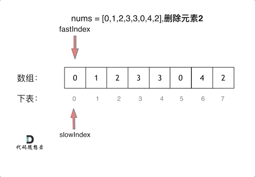

# 1. 数组

## 1. 二分查找

### 704. 二分查找

**题目：**

给定一个 `n` 个元素有序的（升序）整型数组 `nums`和一个目标值 `target` ，写一个函数搜索 `nums` 中的 `target`，如果目标值存在返回下标，否则返回 `-1`。

```c++
class Solution {
public:
    int search(vector<int>& nums, int target) {
        int right = nums.size() - 1;  // 右边界初始化
        int left = 0;  // 左边界初始化

        while (left <= right)
        {
            int mid = left + ((right - left) / 2);
            if (nums[mid] < target)  // 目标值在右半边
            {
                left = mid + 1;
            }
            else if (nums[mid] > target)  // 目标值在左半边
            {
                right = mid - 1;  // 如果是左闭右开，这里就不用-1
            }
            else  // 找到目标值
            {
                return mid;
            }
        }
        
        return -1;  // 未找到目标值
    }
};
```


### 34. 在排序数组中查找元素的第一个和最后一个位置

**题目：**

给你一个按照非递减顺序排列的整数数组 `nums`，和一个目标值`target`。请你找出给定目标值在数组中的开始位置和结束位置。

如果数组中不存在目标值 `target`，返回 `[-1, -1]`。

你必须设计并实现时间复杂度为 `O(log n)` 的算法解决此问题。


参考链接：[link](https://leetcode.cn/problems/find-first-and-last-position-of-element-in-sorted-array/solution/ru-he-ba-yi-dao-er-fen-fa-gei-mian-shi-g-yzcc/)

```c++
class Solution {
public:
    vector<int> searchRange(vector<int>& nums, int target) {
        return {searchLeftOrRightBound(nums, target, "left"), searchLeftOrRightBound(nums, target, "right")};
    }
private:
    int searchLeftOrRightBound(vector<int>& nums, int target, const string& bound)
    {
        int left = 0;
        int right = nums.size() - 1;
        int res = -1;

        while (left <= right)
        {
            int mid = left + ((right - left) >> 1);
            if (nums[mid] < target)  // target在右边的区间里，且肯定不是mid索引的元素，所以+1操作
            {
                left = mid + 1;  // [left, right] --> [mid + 1, right]
            }
            else if (nums[mid] > target)  // target在左边的区间里，且肯定不是mid索引的元素，所以-1操作
            {
                right = mid - 1;  // [left, right] -->[left, mid - 1]
            }
            else  // 第三种情况  nums[mid] == target
            {
                res = mid;  // 记录一下mid
                if (bound == "left")  // 如果是找做target第一个元素，则nums[mid] == target的情况下，第一个元素如果不是mid，那肯定在左边
                {
                    right = mid -1;  // 所以这里就更新一下右区间
                }
                else if (bound == "right")  // 如果是找做target最后一个元素，则nums[mid] == target的情况下，最后一个元素如果不是mid，那肯定在右边
                {
                    left = mid + 1;  // 所以这里就更新一下左区间
                }
                else
                {
                    // 异常处理段
                    cout << "传入正确边界参数" << endl;
                    break;
                }
            }
        }

        return res;
    }
};
```


### 69. x 的平方根 


给你一个非负整数 `x `，计算并返回 `x `的 算术平方根 。

由于返回类型是整数，结果只保留 **整数部分** ，小数部分将被 **舍去** 。

注意：不允许使用任何内置指数函数和算符，例如 `pow(x, 0.5)` 或者 `x ** 0.5` 。


参考链接：[link](https://leetcode.cn/problems/sqrtx/solution/x-de-ping-fang-gen-by-s1amduncan-74hw/)

```c++
class Solution {
public:
    int mySqrt(int x) {
        int left = 0;
        int right = x;
        int result = 0;
        
        // 1. mid的平方小于x，那么有可能就是result，也有可能不是；
        // 2. mid的平方大于x，那么肯定不是result，就继续往小的猜，令right = mid - 1；
		// 3. mid的平方刚好等于x，那么再经过边界更新就不满足left <= right了。
        while (left <= right)
        {
            int mid = left + ((right - left) / 2);
            if ((long)mid * mid <= x)  // 强转成long类型，因为这里可能会超出int的范围
            {
                result = mid;  // 直接给result赋值,然后如果后续还能进行二分，即left <= right，就继续更新
                left = mid + 1;  // 所需的数在有半边
            }
            else  // 所需要的数在左半边
            {
                right = mid - 1;
            }
        }

        return result;  // 返回结果
    }
};
```


## 2. 移除元素

### 27. 移除元素

双指针思路：[link](https://www.bilibili.com/video/BV12A4y1Z7LP/?vd_source=ff498e5dc05e7bbe6be82c1d9e17f9fa)

快指针用来寻找新数组所需的元素，即除了需要删除的元素之外的所有元素；

慢指针用来记录新数组所需的元素。



```c++
class Solution {
public:
    int removeElement(vector<int>& nums, int val) {
        int slowIndex = 0;
        int size = nums.size();
        for (int fastIndex = 0; fastIndex < size; fastIndex++)
        {
            if (nums[fastIndex] != val)  // 寻找并不需要删除的元素
            {
                nums[slowIndex] = nums[fastIndex];  // 记录不需要删除的元素
                slowIndex++;  // 慢指针后移一位
            }
        }
        return slowIndex;  // 最后返回的slowIndex就是新数组的长度
    }
};
```


### 26. 删除有序数组中的重复项

参考链接：[link](https://leetcode.cn/problems/remove-duplicates-from-sorted-array/solution/shuang-zhi-zhen-shan-chu-zhong-fu-xiang-dai-you-hu/)

```c++
class Solution {
public:
    int removeDuplicates(vector<int>& nums) {
        int slowIndex = 0;
        int size = nums.size();

        if (size == 0) return 0;  // 判断nums是否为空
        
        // 1.如果快慢指针索引的元素相等，则快指针向后移一位，即fastIndex++操作
        // 2.如果快慢指针索引的元素不相等，则在慢指针后一位记录快指针索引的元素，即nums[++slowIndex] == nums[fastIndex]

        for (int fastIndex = 1; fastIndex < size; fastIndex++)  // 快指针初始化为1
        {
            if (nums[slowIndex] != nums[fastIndex])  // 找到非重复项
            {
                nums[++slowIndex] = nums[fastIndex];  // 在slowIndex + 1处 记录fastIndex索引的元素
            }
        }

        return slowIndex + 1  // 这里不好理解，可以举个极端的例子，例如nums是全为1的vector，最后删除重复项之后就只剩1个元素，没有非重复项，slowIndex就是0,所以要+1
    }
};
```


### 283. 移动零

参考链接：[link](https://leetcode.cn/problems/move-zeroes/solution/dong-hua-yan-shi-283yi-dong-ling-by-wang_ni_ma/)

```c++
class Solution {
public:
    void moveZeroes(vector<int>& nums) {
        int slowIndex = 0, size = nums.size();
        if (size == 0)  // 判断是否为空
        {
            return;
        }

        for (int fastIndex = 0; fastIndex < size; fastIndex++)
        {
            if (nums[fastIndex] != 0)  // 寻找不等于0的元素
            {
                // 1.先用slowIndex去记录不等于0的元素
                // 2.slowIndex++
                nums[slowIndex++] = nums[fastIndex];
            }

            // 如果找到等于0的元素，只进行fastIndex++
        }

        for (; slowIndex < size; slowIndex++)  // 对于slowIndex后面的元素都赋值为0
        {
            nums[slowIndex] = 0;
        }
    }
};
```


## 3. 有序数组的平方

### 977. 有序数组的平方

```c++
class Solution {
public:
    vector<int> sortedSquares(vector<int>& nums) {
        int k = nums.size() - 1;  // 数组的索引，为长度-1
        // int k = nums.size();  // 也可以写成这样
        vector<int> result(nums.size(), 0);  // 创建个等长的全为0的新数组
        // vector<int> result(k, 0);

        // 比较nums[i] * nums[i]和nums[j] * nums[j]大小，哪个大就记录哪个
        // 然后把记录的那个元素的索引进行更新（i++或者j--），还有result的索引也更新（k--）
        for(int i = 0, j = k; i <= j;)
        // for (int i = 0, j = k - 1; i <= j)
        {
            if (nums[i] * nums[i] < nums[j] * nums[j])
            {
                // 1.j索引的数平方之后更大，就记录它并更新j
                result[k--] = nums[j] * nums[j];  // 先对result[k]进行赋值，然后k--
                // result[--k] = nums[j] * nums[j];  // 先更新k（--k），然后赋值
                j--;
            }
            else
            {
                // 2.i索引的数平方之后更大
                result[k--] = nums[i] * nums[i];
                // result[--k] = nums[i] * nums[i];  // 先更新k（--k），然后赋值
                i++;
            }
        }
        
        return result;
    }
};
```


## 4. 长度最小的子数组

### 209. 长度最小的子数组

**暴力解法：**

```c++
class Solution {
public:
    int minSubArrayLen(int target, vector<int>& nums) {
        int size = nums.size();
        if (size == 0) return 0;

        int result = INT32_MAX;  // 初始化result为最大值
        for (int i = 0; i < size; i++)
        {
            int sum = 0;  // 子序列之和
            int subLength = 0;  // 子数组的长度
            for (int j = i; j < size; j++)
            {
                sum += nums[j];
                if (sum >= target)
                {
                    subLength = j - i + 1;  // 计算子数组的长度
                    result = result < subLength ? result : subLength;
                    break;  // 当前i符合条件的最短子数组已经找到了，跳出内层for循环
                }
            }
        }

        return result == INT32_MAX ? 0 : result;
    }
};
```

暴力解法是可以完成这个操作的，但力扣上提交会超时。


**移动窗口**

思路：

1. 先找到满足子序列之和大于等于目标值
2. 再从起始位置缩小子序列


```c++
class Solution {
public:
    int minSubArrayLen(int target, vector<int>& nums) {
        int size = nums.size();
        int result = INT_MAX;
        int subSum = 0;
        int subLength = 0;

        int slowPoint = 0;  // 定义一个慢指针
        int fastPoint = 0;  // 定义一个快指针

        for (; fastPoint < size; fastPoint++)
        {
            subSum += nums[fastPoint];
            // 根据当前子序列的和大小，不断调节子序列的起始位置
            while (subSum >= target)
            {
                subLength = fastPoint - slowPoint + 1;
                result = result < subLength ? result : subLength;

                // 利用慢指针让连续的子序列从头开始减少一位（-=）
                // 然后对慢指针进行后移（slowPoint++）

                // 一旦子序列减少到subSum小于target，即题目条件不满足时，就停止
                subSum -= nums[slowPoint++];
            }
        }
        return result == INT_MAX ? 0 : result;
    }
};
```


## 5. 螺旋矩阵II

### 59.螺旋矩阵II

