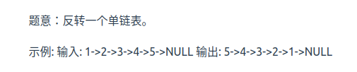

# 2. 链表

## 1. 移除链表元素

### 203. 移除链表元素（简单）

**题目：**

给你一个链表的头节点` head` 和一个整数 `val` ，请你删除链表中所有满足 `Node.val == val `的节点，并返回 新的头节点 。


1. 在没有虚拟头节点的链表里删除满足条件的节点

因为节点删除需要找到其前一个节点，故分为两种情况

a. 需要删除的是头节点

b. 需要删除的是非头节点

2. 设置虚拟头节点，统一删除

#### 解决方法1

参考链接：[link](https://programmercarl.com/0203.%E7%A7%BB%E9%99%A4%E9%93%BE%E8%A1%A8%E5%85%83%E7%B4%A0.html#%E5%85%B6%E4%BB%96%E8%AF%AD%E8%A8%80%E7%89%88%E6%9C%AC)

```c++
/**
 * Definition for singly-linked list.
 * struct ListNode {
 *     int val;
 *     ListNode *next;
 *     ListNode() : val(0), next(nullptr) {}
 *     ListNode(int x) : val(x), next(nullptr) {}
 *     ListNode(int x, ListNode *next) : val(x), next(next) {}
 * };
 */
class Solution {
public:
    ListNode* removeElements(ListNode* head, int val) {
        // 删除头节点
        while (head != NULL && head->val == val)
        {
            ListNode* pDel = head;  // 缓存要删除的节点
            head = head->next;  // 将头节点新设置成下一个节点
            delete pDel;  // 删除原来的头节点
        }

        // 删除非头节点
        // 定义一个辅助指针变量
        ListNode* pCurrent = head;
        while (pCurrent != NULL && pCurrent->next != NULL)  // 一直遍历到最后一个节点
        {
            // 找到需要删除的节点的前一个节点
            if (pCurrent->next->val == val)
            {
                ListNode* pDel = pCurrent->next;
                pCurrent->next = pCurrent->next->next;  // 直接让前一个节点跳过需要删除的节点，指向下一个节点
                delete pDel;  // 释放内存
            }
            else
            {
                // 如果不是需要删除的节点，那么就让辅助指针变量后移
                pCurrent = pCurrent->next;
            }
        }

        // 返回头节点
        return head;
    }
};
```


#### 解决方法2

```c++
/**
 * Definition for singly-linked list.
 * struct ListNode {
 *     int val;
 *     ListNode *next;
 *     ListNode() : val(0), next(nullptr) {}
 *     ListNode(int x) : val(x), next(nullptr) {}
 *     ListNode(int x, ListNode *next) : val(x), next(next) {}
 * };
 */
class Solution {
public:
    ListNode* removeElements(ListNode* head, int val) {
        // 设置一个虚拟头节点
        ListNode* dummyHead = new ListNode(0);  // 设置一个虚拟头节点
        // 将虚拟头节点的next指向真实头节点
        dummyHead->next = head;

        // 定义一个辅助指针，让他指向虚拟头节点
        ListNode* pCurrent = dummyHead;

        while (pCurrent->next != NULL)  // 辅助指针从虚拟头节点开始，一直到最后一个节点，循环
        {
            if (pCurrent->next->val == val)
            {
                ListNode* pDel = pCurrent->next;
                pCurrent->next = pCurrent->next->next;
                delete pDel;
            }
            else
            {
                pCurrent = pCurrent->next;  // 非所需删除的节点，辅助指针向后移动
            }
        }

        head = dummyHead->next;  // 将新列表的头节点进行赋值
        delete dummyHead;  // 释放内存
        return head;  // 返回结果
    }
};
```


## 2. 设计链表

### 707.设计链表（中等）

参考链接：[link](https://leetcode.cn/problems/design-linked-list/solution/by-linken_54-7moa/)


## 3. 翻转链表 

### 206. 反转链表（简单）



#### 双指针法

```c++
class Solution {
public:
    ListNode* reverseList(ListNode* head) {
        ListNode* pCurrent = head;  // 定义一个快指针  初始化为头节点
        ListNode* pNull = NULL;  // 定义一个慢指针  初始化为NULL

        while (pCurrent != NULL)
        {
            // 1.保存好当前pCurrent->next指向的节点，因为重新给pCurrent->next指向之后，就没办法利用pCurrent->next找到这个节点了
            ListNode* pTemp = pCurrent->next;

            // 2.重新给pCurrent->next指向  指向NULL
            pCurrent->next = pNull;

            // 3.重新给pCurrent 和 pNull赋值
            pNull = pCurrent;  // 慢指针当前的节点
            pCurrent = pTemp;  // 快指针指向保存好的下一个节点
        }
        // 最后pCurrent指向原来的尾部NULL，pNull指向反转后的头节点
        return pNull;
    }
};
```


*20230618*

```c++
class Solution {
public:
    ListNode* reverseList(ListNode* head) {
        // 双指针法
        // 定义一个快指针指向头节点
        ListNode* pFast = head;
        // 定义一个慢指针指向NULL
        ListNode* pSlow = nullptr;

        // 同时向前遍历
        while (pFast != nullptr)  // 当快指针都遍历到原链表的尾部null时，说明最后一个节点也被遍历了
        {
            // 首先保存好快指针的下一个节点，不然待会修改指向后就找不到了
            ListNode* pDummy = pFast->next;
            // 然后让快指针的下一个节点指向慢指针，完成指向修改
            pFast->next = pSlow;
            // 更新快慢指针，由于链表的节点需要通过前一个节点来找，所以：
            // 首先更新慢指针
            pSlow = pFast;
            // 再更新快指针，指向原本的下一个节点
            pFast = pDummy;
        }

        // 最后返回的慢指针就是新头节点
        return pSlow;
    }
};
```


## 4. 两两交换链表中的节点

### 24. 两两交换链表中的节点（中等）

**题目：**

给定一个链表，两两交换其中相邻的节点，并返回交换后的链表。

你不能只是单纯的改变节点内部的值，而是需要实际的进行节点交换。

**解题参考：**

[代码随想录](https://www.programmercarl.com/0024.%E4%B8%A4%E4%B8%A4%E4%BA%A4%E6%8D%A2%E9%93%BE%E8%A1%A8%E4%B8%AD%E7%9A%84%E8%8A%82%E7%82%B9.html#_24-%E4%B8%A4%E4%B8%A4%E4%BA%A4%E6%8D%A2%E9%93%BE%E8%A1%A8%E4%B8%AD%E7%9A%84%E8%8A%82%E7%82%B9)


```c++
class Solution {
public:
    ListNode* swapPairs(ListNode* head) {
        // 设置虚拟头节点
        ListNode* dummyHead = new ListNode(0);
        // 将虚拟头节点的next赋为头节点
        dummyHead->next = head;
        // 创建临时指针
        ListNode* pCurrent = dummyHead;
        while (pCurrent->next != nullptr && pCurrent->next->next != nullptr)
        {
            // 保存原本的第一个节点
            ListNode* pTemp = pCurrent->next;
            // 保存原本的第三个节点
            ListNode* pTemp1 = pCurrent->next->next->next;

            // 1.将虚拟头节点的下一个节点指向原本的的第二个节点
            pCurrent->next = pCurrent->next->next;
            // 2.将上一步指向的节点的下一个节点指向原本的第一个节点
            // 这样就完成了原本的第一个和第二个节点的互换
            pCurrent->next->next = pTemp;
            // 3.将完成互换之后的第二个节点的next指向原本的第三个节点
            pCurrent->next->next->next = pTemp1;

            // 完成后 更新pCurrent
            // 向后移动两位
            pCurrent = pCurrent->next->next;
        }
        return dummyHead->next;
    }
};
```


*20230711*

参考链接：[力扣](https://leetcode.cn/problems/swap-nodes-in-pairs/solution/cshi-xian-ji-bai-100jian-dan-yi-dong-by-fjouu/)


```c++
class Solution {
public:
    ListNode* swapPairs(ListNode* head) {
        ListNode* dummyHead = new ListNode(0); // 设置一个虚拟头结点
        dummyHead->next = head; // 将虚拟头结点指向head，这样方面后面做删除操作
        ListNode* cur = dummyHead;
        while(cur->next != nullptr && cur->next->next != nullptr) {
            ListNode* tmp1 = cur->next; // 记录临时节点
            ListNode* tmp2 = cur->next->next;
            ListNode* tmp3 = cur->next->next->next; // 记录临时节点

            cur->next = tmp2;    // 步骤一
            cur->next->next = tmp1;          // 步骤二
            cur->next->next->next = tmp3;   // 步骤三

            cur = cur->next->next; // cur移动两位，准备下一轮交换
        }
        return dummyHead->next;
    }
};
```


## 5. 删除链表的倒数第N个节点

### 19. 删除链表的倒数第N个节点（中等）

**题目：**

给你一个链表，删除链表的倒数第 `n` 个结点，并且返回链表的头结点。

**解题思路：**

参考链接：[代码随想录](https://www.programmercarl.com/0019.%E5%88%A0%E9%99%A4%E9%93%BE%E8%A1%A8%E7%9A%84%E5%80%92%E6%95%B0%E7%AC%ACN%E4%B8%AA%E8%8A%82%E7%82%B9.html#_19-%E5%88%A0%E9%99%A4%E9%93%BE%E8%A1%A8%E7%9A%84%E5%80%92%E6%95%B0%E7%AC%ACn%E4%B8%AA%E8%8A%82%E7%82%B9)

总体思路：利用两个指针来寻找倒数第`n`个节点，另外，因为需要做删除操作，最好时找到该节点的前一个节点

1. 定义快慢指针指向虚拟头节点，让快指针先移动`n+1`步，这样两个指针间隔就是`n+1`
2. 同时移动快慢指针，当快指针指向末尾，即`nullptr`时结束
3. 这个时候两个指针的间隔还是`n+1`，那么就找到了第`n`个节点的前驱节点
4. 利用慢指针指向的前驱节点进行删除

```c++
class Solution {
public:
    ListNode* removeNthFromEnd(ListNode* head, int n) {
        // 创建虚拟头节点
        ListNode* dummyHead = new ListNode(-1);
        dummyHead->next = head;

        // 创建快慢指针
        ListNode* pSlow = dummyHead;
        ListNode* pFast = dummyHead;

        // 1 先让快指针移动n步
        while (n-- && pFast != nullptr)
        {
            pFast = pFast->next;
        }

        // 2 细节的地方 让快指针再往前走一步，
        // 这样同时移动快慢指针的时候，慢指针就可以指向需要删除节点的前一个节点
        pFast = pFast->next;

        // 3 同时移动快慢指针
        while (pFast != nullptr)
        {
            pFast = pFast->next;
            pSlow = pSlow->next;
        }

        // 4 删除慢指针指向的下一个节点
        // 原理就是让慢指针的next 直接指向下两个节点
        pSlow->next = pSlow->next->next;

        return dummyHead->next;
    }
};
```


*20230712*

```c++
class Solution {
public:
    ListNode* removeNthFromEnd(ListNode* head, int n) {
        // 定义虚拟头节点和快慢指针
        ListNode* dummyNode = new ListNode(0);
        dummyNode->next = head;
        ListNode* fastPtr = dummyNode;
        ListNode* slowPtr = dummyNode;
        // 题目指出n不超过节点数目，直接用for循环
        for (int i = 0; i < n + 1; i++)
        {
            fastPtr = fastPtr->next;
        }
        // 同时移动
        while (fastPtr != nullptr)
        {
            fastPtr = fastPtr->next;
            slowPtr = slowPtr->next;
        }
        // 删除操作
        ListNode* temp = slowPtr->next;
        slowPtr->next = slowPtr->next->next;
        delete temp;
        // 释放内存
        ListNode* newHead = dummyNode->next;
        delete dummyNode;
        return newHead;
    }
};
```


## 6. 链表相交

### 面试题 02.07 链表相交（简单）

**题目：**

给你两个单链表的头节点 `headA` 和 `headB` ，请你找出并返回两个单链表相交的起始节点。如果两个链表没有交点，返回 `null` 。


#### 解决方法1

**解题思路：**

这个方法比较复杂，直接看解决方法2

```c++
class Solution {
public:
    ListNode *getIntersectionNode(ListNode *headA, ListNode *headB) {
        // 创建辅助指针
        ListNode* curA = headA;
        ListNode* curB = headB;

        // 计算链表长度
        int lenA = 0, lenB = 0;
        while (curA != NULL)
        {
            lenA++;
            curA = curA->next;
        }
        while (curB != NULL)
        {
            lenB++;
            curB = curB->next;
        }

        // 让辅助指针重新指向两个链表的头节点
        curA = headA;
        curB = headB;

        // 保证curA指向最长链表
        if (lenB > lenA)  // 如果不是，就交换
        {
            swap(lenA, lenB);
            swap(curA, curB);
        }

        // 求出长度差
        int gap = lenA - lenB;

        // 让curA先遍历gap
        while (gap--)
        {
            curA = curA->next;
        }
        // 再一起遍历curA和curB
        while (curA != NULL)
        {
            if (curA == curB)
            {
                return curA;
            }
            // 更新curA 和 curB
            curA = curA->next;
            curB = curB->next;
        }

        // 遍历完都没有找到，则返回NULL
        return NULL;
    }
};
```


#### 解决方法2

**解题思路：**

参考链接：[LeetCode](https://leetcode.cn/problems/intersection-of-two-linked-lists-lcci/solution/mian-shi-ti-0207-lian-biao-xiang-jiao-sh-b8hn/)


```c++
class Solution {
public:
    ListNode *getIntersectionNode(ListNode *headA, ListNode *headB) {
        // 创建辅助指针
        ListNode* A = headA;
        ListNode* B = headB;

        // 两个辅助指针同步遍历两个链表
        // 具体来说，A先遍历链表1，然后再从链表2的头节点开始遍历链表2
        // B也是这样

        // 当A = B时，走到公共节点
        while (A != B)
        {
            // 这里就是如果辅助指针遍历完了一个链表，就让其指向下一个链表的头节点
            A = A != NULL ? A->next : headB;
            B = B != NULL ? B->next : headA;

            // 特殊情况就是，两个链表没有交点
            // 辅助指针A和B最后都遍历完两个链表，都能等于null，循环结束
        }

        return A;
    }
};
```


## 7.环形链表II

### 142. 环形链表II（中等）

**题目：**

给定一个链表的头节点  `head` ，返回链表开始入环的第一个节点。 *如果链表无环，则返回 `null`。*


**解题思路：**

1. 设置快慢指针，快指针移动两步，慢指针移动一步

2. 找相遇节点，只要有环，快慢指针肯定会相遇，循环条件就是快指针移动到`null`或者它的下一个节点是`null`


3. 找到相遇节点，再利用两个辅助指针，记录相遇节点和头节点，同时移动一步，相等时就是环形入口


参考链接中有公式推理：[代码随想录](https://programmercarl.com/0142.%E7%8E%AF%E5%BD%A2%E9%93%BE%E8%A1%A8II.html#%E6%80%9D%E8%B7%AF)


```c++
class Solution {
public:
    ListNode *detectCycle(ListNode *head) {
        // 1.定义快慢指针
        ListNode* pFast = head;
        ListNode* pSlow = head;

        // 2.找两个指针相遇的节点
        // 因为pFast每次移动两步，所以判断只要当前快指针是null或者它的下一个节点是null，就结束循环
        while (pFast != NULL && pFast->next != NULL)
        {
            // 慢指针移动一步
            pSlow = pSlow->next;
            // 快指针移动两步
            pFast = pFast->next->next;

            // 找到相遇节点
            if (pSlow == pFast)
            {
                // 定义辅助指针，记录相遇节点和头节点
                ListNode* pIdx1 = pFast;
                ListNode* pIdx2 = head;

                // 两个节点同时移动，相等时就是 入口节点
                while (pIdx1 != pIdx2)
                {
                    pIdx1 = pIdx1->next;
                    pIdx2 = pIdx2->next;
                }

                return pIdx1;
            }
        }
        
        return NULL;
    }
};
```

