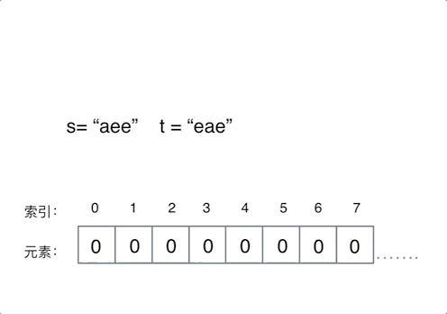

# 3. 哈希表

[基本知识链接](https://programmercarl.com/%E5%93%88%E5%B8%8C%E8%A1%A8%E7%90%86%E8%AE%BA%E5%9F%BA%E7%A1%80.html#%E5%93%88%E5%B8%8C%E8%A1%A8)


## 1. 有效字母异位词

### 242. 有效的字母异位词（简单）

**题目：**

给定两个字符串 s 和 t ，编写一个函数来判断 t 是否是 s 的字母异位词。

注意：若 s 和 t 中每个字符出现的次数都相同，则称 s 和 t 互为字母异位词。


**解题思路：**

1. 初始化一个记录字符出现次数的数组（哈希表），size为26
2. 遍历第一个字符串，在字符相对`a`的位置处做`+1`操作，如下图
3. 再遍历第二个字符串，在字符相对`a`的位置处做`-1`操作，如下图
4. 最后再遍历数组，如果有非0数，则说明两个字符串不是异位数，反之则是异位数



```c++
class Solution {
public:
    bool isAnagram(string s, string t) {
        // 初始化一个记录字符出现次数的数组
        int record[26] = {0};

        // 遍历字符串s
        for (int i = 0; i < s.size(); i++)
        {
            // 并不需要具体记录字符的ASCII，只需要记录相对的值
            // 即 a代表0,b代表1....
            record[s[i] - 'a']++;
        }
        // 遍历字符串t
        for (int i = 0; i < t.size(); i++)
        {
            // 出现某个字符，就在它对应的位置记录-1
            record[t[i] - 'a']--;
        }
        // 遍历完后查看record情况
        // 均为0则返回true，是字母异位词
        for (int i = 0; i < sizeof(record) / sizeof(record[1]); i++)
        {
            // 如果出现有非0数，返回false
            if (record[i] != 0)
            {
                return false;
            }
        }

        return true;
    }
};
```

### 383. 赎金信（简单）

**题目：**

给你两个字符串：`ransomNote` 和 `magazine` ，判断 `ransomNote` 能不能由 `magazine` 里面的字符构成。

如果可以，返回 true ；否则返回 false 。

`magazine` 中的每个字符只能在 `ransomNote` 中使用一次。

**解题思路：**

和242题类似，但判断情况有些不同

当遍历第二个字符串的时候，做`-1`操作之后，**判断一下当前操作的数组位置记录的是否小于0**，如果小于0，则返回`false`

```c++
class Solution {
public:
    bool canConstruct(string ransomNote, string magazine) {
        // 初始化一个记录字符出现次数的数组
        int record[26] = {0};

        // 遍历第一个字符串 magazine
        for (int i = 0; i < magazine.size(); i++)
        {
            // 记录字符出现的次数 做+1操作
            record[magazine[i] - 'a']++;
        }
        // 遍历第二个字符串 ransomNote
        for (int i = 0; i < ransomNote.size(); i++)
        {
            // 记录字符出现次数 做-1操作
            record[ransomNote[i] - 'a']--;
            // 一旦出现小于0,即ransomNote中有magazine中不曾出现或者出现次数不够的字符
            // 直接返回false
            if (record[ransomNote[i] - 'a'] < 0)
            {
                return false;
            }
        }
        
        return true;
    }
};
```

## 2. 两个数组的交集

### 349. 两个数组的交集（简单）

**题目：**

给定两个数组，编写一个函数来计算它们的交集。

说明： 输出结果中的每个元素一定是唯一的。 我们可以不考虑输出结果的顺序。


#### 解题方法1

利用一种哈希数据结构：`unordered_set`


```c++
class Solution {
public:
    vector<int> intersection(vector<int>& nums1, vector<int>& nums2) {
        // 创建一个存放结果的unordered_set
        unordered_set<int> result_set;
        // 拷贝一份 nums1 到unordered_set，用于比较
        unordered_set<int> nums_set(nums1.begin(), nums1.end());
        // 遍历nums2
        for (int num : nums2)
        {
            // 如果发现num在nums_set中重复出现了，记录它
            if (nums_set.find(num) != nums_set.end())
            {
                // find()，如果没找到默认返回end()迭代器
                result_set.insert(num);
            }
        }

        // 最后返回结果，利用拷贝构造,返回vector
        return vector<int>(result_set.begin(), result_set.end());
    }
};
```

#### 解题方法2

对于有确定数值范围的情况下，可以使用数组

```c++
class Solution {
public:
    vector<int> intersection(vector<int>& nums1, vector<int>& nums2) {
        // 存放结果，用这个容器是为了去重
        unordered_set<int> result_set;
        // 初始化一个数组，记录映射出现的次数
        int hash[1005] = {0};

        // 遍历第一个数组 赋值为1
        for (int num : nums1)
        {
            hash[num] = 1;  // 不考虑重复的情况
        }
        // 遍历第二个数组
        for (int num : nums2)
        {
            // 如果同时在nums1中出现
            if (hash[num] == 1)
            {
                result_set.insert(num);
            }
        }

        // 拷贝构造的方法 返回最后结果
        return vector<int>(result_set.begin(), result_set.end());
    }
};
```


## 3. 快乐数

### 202. 快乐数（简单）

**题目：**

编写一个算法来判断一个数 n 是不是快乐数。

「快乐数」定义为：对于一个正整数，每一次将该数替换为它每个位置上的数字的平方和，然后重复这个过程直到这个数变为 1，也可能是 无限循环 但始终变不到 1。如果 可以变为 1，那么这个数就是快乐数。

如果 n 是快乐数就返回 True ；不是，则返回 False 。

**示例：**

输入：19
输出：true
解释：
1^2 + 9^2 = 82
8^2 + 2^2 = 68
6^2 + 8^2 = 100
1^2 + 0^2 + 0^2 = 1

**解题思路：**

[代码随想录链接](https://programmercarl.com/0202.%E5%BF%AB%E4%B9%90%E6%95%B0.html)

**当我们遇到了要快速判断一个元素是否出现集合里的时候，就要考虑哈希法了。**

判断sum是否重复出现就可以使用unordered_set。

1. 写一个返回求和结果`sum`，计算每个位置平方和结果的函数
2. 利用这个函数返回的结果`sum`，判断是否是快乐数，或者是否进入死循环了
3. 具体就是，`sum == 1`就是快乐数，如果能在`unordered_set`里面找到，说明出现过了，进入死循环了，反之就记录这个数
4. 最后别忘了更新下一个循环的`n`

```c++
class Solution {
public:
    // 取各个位置的数值 做平方
    int getSum(int n)
    {
        int sum = 0;
        while (n)
        {
            // 先记录个位数
            sum += (n % 10) * (n % 10);
            // 再除于10，然后循环继续记录个位数
            n /= 10;
        }
        return sum;
    }

    bool isHappy(int n) {
        // 初始化一个set
        unordered_set<int> set;
        while (1)
        {
            // 做快乐数计算
            int sum = getSum(n);
            if (sum == 1)
            {
                // 如果sum==1，返回true
                return true;
            }

            // 如果sum出现过，则说明进入无限循环了，返回false
            if (set.find(sum) != set.end())
            {
                return false;
            }
            else
            {
                set.insert(sum);
            }

            // 完成记录之后 更新n，进入下一个循环
            n = sum;
        }
    }
};
```


## 4. 两数之和

### 1. 两数之和（简单）

**题目：**

给定一个整数数组 `nums `和一个目标值 `target`，请你在该数组中找出和为目标值的那 两个 整数，并返回他们的数组下标。

你可以假设每种输入只会对应一个答案。但是，数组中同一个元素不能使用两遍。

**解题思路：**

用数据元素去查询下标，所以 map中的存储结构为 {key：数据元素，value：数组元素对应的下标}。

1. 利用`unordered_map`来记录数组里面的数据元素和下标
2. 先遍历数组元素，然后去`unordered_map`中寻找另一个符合条件的数
3. 如果没找到，则把当前遍历出来的元素存放到`unordered_map`中，如果找到了，则返回遍历的索引和容器中对应的`value`

```c++
class Solution {
public:
    vector<int> twoSum(vector<int>& nums, int target) {
        unordered_map<int, int> map;
        for (int i = 0; i < nums.size(); i++)
        {
            // 遍历数组元素，并在map中寻找匹配的数
            auto iter = map.find(target - nums[i]);
            // 如果找到map中有匹配的数
            if (iter != map.end())
            {
                // 返回value和i
                return {iter->second, i};
            }
            // 如果没找到，则把遍历出来的数组元素记录到map
            map.insert(pair<int, int>(nums[i], i));
        }

        // 最后如果都没找到的话，返回空
        return {};
    }
};
```


## 5. 四数相加II

### 454. 四数相加II（中等）

**题目：**

给定四个包含整数的数组列表 A , B , C , D ,计算有多少个元组 (i, j, k, l) ，使得 A[i] + B[j] + C[k] + D[l] = 0。

为了使问题简单化，所有的 A, B, C, D 具有相同的长度 N，且 0 ≤ N ≤ 500 。所有整数的范围在 -2^28 到 2^28 - 1 之间，最终结果不会超过 2^31 - 1 。

**解题思路：**

这道题目是四个独立的数组，只要找到A[i] + B[j] + C[k] + D[l] = 0就可以，不用考虑有重复的四个元素相加等于0的情况

思路和两数之和的类似

1. 利用一个`unordered_map`记录前两个数组A和B遍历出来的元素a与b之和，以及之和出现的次数
2. 再去遍历数组C和D的元素c和d，判断`unorderen_map`中是否有`a + b`满足`a + b + c + d = 0`
3. 如果有，说明满足条件，且`a + b`对应的`value`就是满足条件出现的次数，用一个变量记录下来

```c++
class Solution {
public:
    int fourSumCount(vector<int>& nums1, vector<int>& nums2, vector<int>& nums3, vector<int>& nums4) {
        // key记录a+b的和，value记录a+b之和出现的次数
        unordered_map<int, int> uMap;
        // 遍历A和B，统计元素之和，和出现的次数
        for (int a : nums1)
        {
            for (int b : nums2)
            {
                // +1操作
                uMap[a + b]++;
            }
        }

        // 初始化一个int变量记录满足条件的情况
        int count = 0;
        // 遍历C和D，去找0 - (c + d)是否在uMap中出现过
        for (int c : nums3)
        {
            for (int d : nums4)
            {
                // 如果出现过，则记录uMap中a+b之和出现的次数，即为满足条件的次数
                if (uMap.find(0 - c - d) != uMap.end())
                {
                    count += uMap[0 - c - d];
                }
            }
        }

        // 最后返回结果
        return count;
    }
};
```

