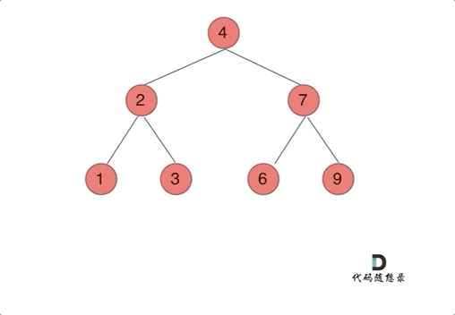
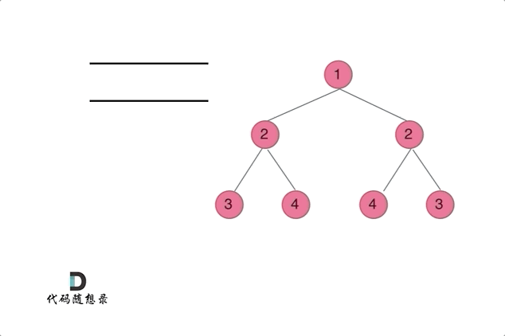

# 7. 二叉树

## 1. 二叉树的理论基础

先序和中序能确定一个二叉数，

中序和后序能确定一个二叉数，

先序和后序不能。


定义：

```c++
struct TreeNode
{
    int val;  // 节点本身的值
    TreeNode* left;  // 左子节点
    TreeNode* right;  // 右子节点
    TreeNode(int x) : val(x), left(NULL), right(NULL) {}
};
```


## 2/3. 二叉树的递归/迭代遍历

### 144. 二叉树的前序遍历（简单）

#### 递归法

递归算法遍历的顺序是：中左右！

```c++
class Solution {
public:
    void traversal(TreeNode* cur, vector<int>& vec)
    {
        if (cur == nullptr) return;

        // 前序遍历，中左右的顺序
        vec.push_back(cur->val);
        // 先递归左边的结点
        traversal1(cur->left, vec);
        // 再递归右边
        traversal1(cur->right, vec);
    }

    vector<int> preorderTraversal(TreeNode* root) {
        vector<int> result;
        traversal(root, result);
        return result;
    }
};
```

#### 迭代法


这里需要注意，**栈的特性是先进后出，同时遍历压入栈的时候，不要压入空节点。**

```c++
class Solution {
public:
    vector<int> preorderTraversal(TreeNode* root) {
        // 初始化栈
        stack<TreeNode*> st;
        // 初始化记录结果的容器
        vector<int> result;

        if (root == nullptr) return result;
        // 压入根节点
        st.push(root);
        while (!st.empty())  // 栈为空时，结束
        {
            // 记录栈顶节点
            TreeNode* node = st.top();  // 第一次循环里是根节点
            // 弹出栈顶节点
            st.pop();
            // 记录栈顶节点的val
            result.push_back(node->val);
            // 根据先进后出的栈原理，在这先压入右节点
            if (node->right) st.push(node->right);  // 空节点不入栈
            // 再压入左节点
            if (node->left) st.push(node->left);
        }

        return result;
    }
};
```


### 94. 二叉树的中序遍历（简单）

#### 递归法

遍历顺序：左中右！

```c++
class Solution {
public:
    void travelsal(TreeNode* cur, vector<int>& vec)
    {
        if (cur == nullptr) return;

        // 中序遍历的顺序，左中右
        travelsal(cur->left, vec);
        vec.push_bask(cur->val);
        travelsal(cur->right, vec);
    }

    vector<int> inorderTraversal(TreeNode* root) {
        vector<int> result;
        travelsal(root, result);
        return result;
    }
};
```


#### 迭代法

两件事：

1. 处理节点储存元素，存放到vector中
2. 访问每个节点

然而中序遍历是左中右的顺序，但访问节点是从中间开始的，这也就导致了不能访问完接着处理。


```c++
class Solution {
public:
    vector<int> inorderTraversal(TreeNode* root) {
        // 初始化访问节点和存储值的容器
        vector<int> result;
        stack<TreeNode*> st;
        // 初始化一个辅助指针，来协助一起访问节点
        TreeNode* cur = root;

        while (cur != nullptr || !st.empty())
        {
            if (cur != nullptr)  // 上来直接用指针访问节点，一直到左边最底层
            {
                // 然后用栈来存放节点
                st.push(cur);
                // 更新cur，如果是底层节点的话，更新一下就变成NULL了
                cur = cur->left;
            }
            else
            {
                // 如果当前循环的cur是NULL那就意味着是底层节点或者其孩子节点已经弹出了
                // 这里记录栈顶节点，开始记录元素操作
                cur = st.top();
                st.pop();  // 别忘了弹出栈顶
                result.push_back(cur->val);
                // 记录好之后，更新cur的右节点
                cur = cur->right;
            }
        }
        return result;
    }
};
```


### 145. 二叉树的后序遍历（简单）

#### 递归法

遍历顺序是：左右中！

```c++
class Solution {
public:
    void traversal(TreeNode* cur, std::vector<int>& vec)
    {
        if (cur == nullptr) return;

        // 后序遍历，左右中的顺序
        traversal3(cur->left, vec);
        traversal3(cur->right, vec);
        vec.push_back(cur->val);
    }

    vector<int> postorderTraversal(TreeNode* root) {
        vector<int> result;
        traversal(root, result);
        return result;
    }
};
```


#### 迭代法


1. 先再前序遍历中修改左右访问节点的顺序，得到中右左的结果
2. 反转结果容器，变成左右中的结果，刚好是后序遍历的结果

```c++
class Solution {
public:
    vector<int> postorderTraversal(TreeNode* root) {
        // 初始化访问节点和存储值的容器
        vector<int> result;
        stack<TreeNode*> st;

        if (root == nullptr) return result;
        // 压入根节点
        st.push(root);
        while (!st.empty())
        {
            // 记录栈顶节点
            TreeNode* node = st.top();
            // 别忘了记录好后弹出
            st.pop();
            // 记录栈顶节点的val
            result.push_back(node->val);
            // 根据想要的中右左，在这里先压入左节点，先进后出
            if (node->left) st.push(node->left);
            if (node->right) st.push(node->right);
        }

        // 得到中右左的结果，反转一下
        reverse(result.begin(), result.end());

        return result;
    }
};
```


## 4. 二叉树的统一迭代法

以中序遍历为例，使用栈的话，无法同时解决访问节点（遍历节点）和处理节点（将元素放进结果集）不一致的情况。

那我们就将访问的节点放入栈中，把要处理的节点也放入栈中但是要做标记。

如何标记呢，就是要处理的节点放入栈之后，紧接着放入一个空指针作为标记。 这种方法也可以叫做标记法。


### 94. 二叉树的中序遍历（简单）


**跟着上图理解下面的代码，后面的前序遍历和后序遍历思路与之一致。**

```c++
class Solution {
public:
    vector<int> inorderTraversal(TreeNode* root) {
        // 定义一个存放结果的容器
        vector<int> result;
        // 定义一个用来遍历的容器
        stack<TreeNode*> st;
        // 先压入根节点
        if (root != nullptr) st.push(root);
        while (!st.empty())  // 如果st不为空，就一直循环
        {
            // 定义一个临时节点，记录栈顶节点
            TreeNode* node = st.top();
            // 判断临时节点记录的是否为空节点
            if (node != nullptr)  // 如果不为空节点
            {
                st.pop();  // 先弹出节点，避免重复操作
                // 接下来现依次加入右中左节点，因为先进后出
                if (node->right) st.push(node->right);  // 添加右节点，空节点不入栈
                // 添加中节点
                st.push(node);
                // 核心部分，因为中节点访问过，但是还没处理，我们这里加入空节点进行标记
                st.push(nullptr);
                if (node->left) st.push(node->left);  // 添加左节点，空节点不入栈
            }
            else
            {
                // 只有遇到空节点的时候，才将下一个节点放进结果集
                // 1.先弹出空节点
                st.pop();
                // 2.对空节点的下一个节点进行操作
                node = st.top();
                st.pop();
                result.push_back(node->val);  // 放入结果集
            }
        }
        return result;
    }
};
```


### 144. 二叉树的前序遍历（简单）

```c++
class Solution {
public:
    vector<int> preorderTraversal(TreeNode* root) {
        // 定义结果集
        vector<int> result;
        // 定义栈
        stack<TreeNode*> st;
        // 压入根节点
        if (root != nullptr) st.push(root);
        while (!st.empty())
        {
            // 只要栈不为空，就一直循环遍历
            // 先定义一个临时节点，用来记录栈顶节点
            TreeNode* node = st.top();
            // 根据此时的栈顶节点，来判断是否放入结果集
            if (node != nullptr)
            {
                // node不等于null说明没有标记
                // 那就先弹出这个节点
                st.pop();
                // 前序遍历是中左右，那么接下来就是依次存放右左中
                // 存放右节点
                if (node->right != nullptr) st.push(node->right);
                // 存放左节点
                if (node->left != nullptr) st.push(node->left);
                // 关键在于存放中节点
                st.push(node);
                // 再存放一个null进行标记
                st.push(nullptr);
            }
            else
            {
                // 碰到空节点，说明遇到标记了，下一个节点就是要放入结果集的
                // 1.先弹出空节点
                st.pop();
                // 2.记录栈顶节点
                node = st.top();
                // 3.弹出栈顶节点
                st.pop();
                // 4.存放到结果集
                result.push_back(node->val);
            }
        }
        return result;
    }
};
```


### 145. 二叉树的后序遍历（简单）

```c++
class Solution {
public:
    vector<int> postorderTraversal(TreeNode* root) {
        // 先定义两个容器，记录结果和遍历节点
        vector<int> result;
        stack<TreeNode*> st;
        // 先压入空节点
        if (root != nullptr) st.push(root);
        while (!st.empty())  // 栈不为空，就一直遍历
        {
            // 定义临时节点
            TreeNode* node = st.top();
            // 判断是否为null标记
            if (node != nullptr)
            {
                // 如果不是标记点，就根据遍历方式，存放节点
                // 这里后序遍历，再结合先进后出的特性，依次放入中右左
                st.pop();
                st.push(node);
                st.push(nullptr);
                if (node->right != nullptr) st.push(node->right);
                if (node->left != nullptr) st.push(node->left);
            }
            else
            {
                // 遇到标记，那就处理下一个节点
                st.pop();
                node = st.top();
                st.pop();
                // 将节点存放的数据，放入结果集
                result.push_back(node->val);
            }
        }
        return result;
    }
};
```


## 5. 二叉树的层序遍历

### 102. 二叉树的层序遍历（中等）

**题目：**

给你二叉树的根节点 `root` ，返回其节点值的 **层序遍历** 。 （即逐层地，从左到右访问所有节点）。


#### 迭代法

**解题思路：**


1. 利用队列`queue`记录访问到的数据
2. 利用一个辅助容器`vector`来记录每一层的数据
3. 最后利用一个容器`vector`记录总的数据

```c++
class Solution {
public:
    vector<vector<int>> levelOrder(TreeNode* root) {
        // 初始化一个队列
        queue<TreeNode*> que;
        // 压入根节点
        if (root != NULL) que.push(root);
        // 初始化一个记录结果的容器
        // 返回二维数组
        vector<vector<int>> result;
        while (!que.empty())
        {
            // 记录队列大小
            int size = que.size();
            // 记录每一层数据的容器，一维数组
            vector<int> vec;

            for (int i = 0; i < size; i++)
            {
                // 拿到队列的头节点
                TreeNode* node = que.front();
                que.pop();

                // 获得节点的值
                vec.push_back(node->val);
                // 根据先左后右的方式，在队列中添加当前节点的孩子节点
                if (node->left) que.push(node->left);
                if (node->right) que.push(node->right);
            }
            // 记录一维数组
            result.push_back(vec);
        }
        return result;
    }
};
```


#### 递归法

**解题思路：**

1. 遍历左树
2. 遍历右树

```c++
class Solution {
public:
    void order(TreeNode* cur, vector<vector<int>>& result, int depth)
    {
        if (cur == nullptr) return;
        // 如果深度和层级相等，就压入一个vector
        if (result.size() == depth) result.push_back(vector<int>());
        // 在相应的depth中压入当前节点的数据
        result[depth].push_back(cur->val);
        // 递归，先左后右
        order(cur->left, result, depth + 1);
        order(cur->right, result, depth + 1);
    }

    vector<vector<int>> levelOrder(TreeNode* root) {
        vector<vector<int>> result;
        int depth = 0;
        order(root, result, depth);
        return result;
    }
};
```


## 6. 翻转二叉树

### 226. 翻转二叉树（简单）

**题目：**

给你一棵二叉树的根节点 `root` ，翻转这棵二叉树，并返回其根节点。

#### 递归法



**解题思路：**

利用前序遍历，先反转左右孩子节点，然后在反转左树，最后反转右树。

```c++
class Solution {
public:
    TreeNode* invertTree(TreeNode* root) {
        if (root == nullptr) return root;
        swap(root->left, root->right);
        invertTree(root->left);
        invertTree(root->right);
        return root;
    }
};
```


#### 迭代法

其实迭代法这里已经不是很关心放入栈的顺序了，因为不用记录节点数据，只需要翻转孩子节点就行了。

```c++
class Solution {
public:
    TreeNode* invertTree(TreeNode* root) {
        if (root == nullptr) return root;
        // 定义遍历的栈
        stack<TreeNode*> st;
        // 先压入根节点
        st.push(root);
        while (!st.empty())
        {
            // 定义临时节点
            TreeNode* node = st.top();  // 中
            st.pop();
            swap(node->left, node->right);  // 交换两个孩子节点
            // 将交换后的孩子节点放入栈中
            if (node->left) st.push(node->left);
            if (node->right) st.push(node->right);
        }
        return root;
    }
};
```


#### 统一迭代法

```c++
class Solution {
public:
    TreeNode* invertTree(TreeNode* root) {
        // 定义遍历的栈
        stack<TreeNode*> st;
        // 先压入根节点
        if (root != nullptr) st.push(root);
        while (!st.empty())
        {
            // 定义临时节点
            TreeNode* node = st.top();
            // 判断是否有null标记
            if (node != nullptr)
            {
                st.pop();  // 先弹出，防止重复操作
                // 依次放入节点  右左中
                if (node->right) st.push(node->right);
                if (node->left) st.push(node->left);
                st.push(node);
                st.push(nullptr);
            }
            else
            {
                // 翻转的逻辑
                // 1.先弹出null
                st.pop();
                // 2.拿出下一个节点
                node = st.top();
                st.pop();
                // 3.翻转
                swap(node->left, node->right);
            }
        }
        return root;
    }
};
```


## 8. 对称二叉树

### 101. 对称二叉树（简单）

**题目：**

给你一个二叉树的根节点 `root` ， 检查它是否轴对称。

**解题思路：**


#### 递归法

```c++
class Solution {
public:
    bool compare(TreeNode* left, TreeNode* right)
    {
        // 首先排除空节点的一些情况，
        // 即左右节点有一个是空的就直接返回false，但如果均为空则说明是对称的
        if (left == nullptr && right != nullptr) return false;
        else if (left != nullptr && right == nullptr) return false;
        else if (left == nullptr && right == nullptr) return true;
        // 再排除左右节点数值不同的情况
        else if (left->val != right->val) return false;

        // 接下来就是处理左右节点不为空，且值相同的情况
        // 递归判断 外侧和内侧子树的情况
        bool outside = compare(left->left, right->right);
        bool inside = compare(left->right, right->left);
        // 最后，如果均为true，才是对称
        bool isSame = outside && inside;
        return isSame;
    }

    bool isSymmetric(TreeNode* root) {
        if (root == nullptr) return true;
        return compare(root->left, root->right);
    }
};
```


#### 迭代法

**解题思路：**

这里可以用队列来判断左子树和右子树的内侧和外侧是否相等，



```c++
class Solution {
public:
    bool isSymmetric(TreeNode* root) {
        // 首先，如果是空树，直接返回true
        if (root == nullptr) return true;
        // 定义一个队列
        queue<TreeNode*> que;
        // 将左右节点放入
        que.push(root->left);
        que.push(root->right);
        // 判断是否是对称
        while (!que.empty())
        {
            // 定义来个临时节点
            TreeNode* leftNode = que.front();
            que.pop();
            TreeNode* rightNode = que.front();
            que.pop();
            // 如果左右皆为空，说明是对称的，继续下一个遍历
            if (leftNode == nullptr && rightNode == nullptr)
            {
                continue;
            }
            // 如果有一个节点不为空，或者都不为空但数值不一样，那就不对称，返回false
            if (!leftNode || !rightNode || (leftNode->val != rightNode->val))
            {
                return false;
            }
            // 接下来就是处理左右子树了
            // 外侧节点
            que.push(leftNode->left);  // 加入左节点的左孩子
            que.push(rightNode->right);  // 加入右节点的右孩子
            // 内侧节点
            que.push(leftNode->right);
            que.push(rightNode->left);
        }
        return true;
    }
};
```


## 9. 二叉树的最大深度

### 104. 二叉树的最大深度（简单）

**题目：**

给定一个二叉树，找出其最大深度。

二叉树的深度为根节点到最远叶子节点的最长路径上的节点数。

**说明:** 叶子节点是指没有子节点的节点。

**解题思路：**

本题可以使用前序（中左右），也可以使用后序遍历（左右中），使用前序求的就是深度，使用后序求的是高度。

- 二叉树节点的深度：指从根节点到该节点的最长简单路径边的条数或者节点数（取决于深度从0开始还是从1开始）
- 二叉树节点的高度：指从该节点到叶子节点的最长简单路径边的条数或者节点数（取决于高度从0开始还是从1开始）

**而根节点的高度就是二叉树的最大深度**，所以本题中我们通过后序求的根节点高度来求的二叉树最大深度。


#### 递归法

1. 用后序遍历（左右中）来计算树的高度。

先求它的左子树的深度，再求右子树的深度，最后取左右深度最大的数值 再+1 （加1是因为算上当前中间节点）就是目前节点为根节点的树的深度。

```c++
class Solution {
public:
    int getHeight(TreeNode* node)
    {
        if (node == nullptr) return 0;
        // 后序遍历，求根节点的高度，就是二叉树的最大深度
        int leftheight = getHeight(node->left);  // 左
        int rightheight = getHeight(node->right);  // 右
        // 这才是处理逻辑
        // 当前节点的高度等于左右子树的高度最大值+1
        int height = 1 + max(leftheight, rightheight);  // 中
        return height;
    }

    int maxDepth(TreeNode* root) {
        int depth = getHeight(root);
        return depth;
    }
};
```


2. 使用前序求深度**（先留着，与回溯有关，暂时看不懂）**


#### 迭代法

使用迭代法的话，使用层序遍历是最为合适的，因为最大的深度就是二叉树的层数，和层序遍历的方式极其吻合。

```c++
class Solution {
public:
    int maxDepth(TreeNode* root) {
        if (root == nullptr) return 0;
        // 定义一个记录深度的变量
        int depth = 0;
        // 定义一个队列来遍历节点
        queue<TreeNode*> que;
        // 先压入根节点
        que.push(root);
        while (!que.empty())
        {
            int size = que.size();
            depth++;  // 记录深度
            for (int i = 0; i < size; i++)
            {
                // 先记录队列的头节点
                TreeNode* node = que.front();
                // 别忘了弹出
                que.pop();
                // 再压入当前节点的左右节点
                if (node->left) que.push(node->left);
                if (node->right) que.push(node->right);
            }
        }
        return depth;
    }
};
```


## 10. 二叉树的最小深度

### 111. 二叉树的最小深度（简单）

**题目：**

给定一个二叉树，找出其最小深度。

最小深度是从根节点到最近叶子节点的最短路径上的节点数量。

*说明: 叶子节点是指没有子节点的节点。*


#### 递归法

后序遍历：

```c++
class Solution {
public:
    int getHeight(TreeNode* node)
    {
        // 结束条件，如果遍历到最下面的null，说明高度是0,返回
        if (node == nullptr) return 0;
        // 先求左右子树的最小高度
        int leftHeight = getHeight(node->left);
        int rightHeight = getHeight(node->right);
        // 然后写处理逻辑，也就是中
        // 如果左右子树有一个为null
        if (node->left == nullptr && node->right != nullptr)
        {
            return 1 + rightHeight;
        }
        if (node->right == nullptr && node->left != nullptr)
        {
            return 1 + leftHeight;
        }
        // 左右子树都不为空
        int height = 1 + min(leftHeight, rightHeight);
        return height;
    }

    int minDepth(TreeNode* root) {
        // 求根节点的最小高度，就是最小深度
        int depth = getHeight(root);
        return depth;
    }
};
```


#### 迭代法

层序遍历：

```c++
class Solution {
public:
    int minDepth(TreeNode* root) {
        if (root == nullptr) return 0;
        // 定义记录深度的变量和遍历的队列
        int depth = 0;
        queue<TreeNode*> que;
        // 先压入根节点
        que.push(root);
        // 如果队列不为空，就一直遍历
        while (!que.empty())
        {
            // 记录当前层的节点个数，并更新深度
            int size = que.size();
            depth++;
            for (int i = 0; i < size; i++)
            {
                // 再将当前层的节点进行记录和压入左右孩子节点
                TreeNode* node = que.front();
                que.pop();
                if (node->left) que.push(node->left);
                if (node->right) que.push(node->right);
                // 如果碰到叶子节点，说明孩子节点都为空，那么返回深度
                if (!node->left && !node->right) return depth;
            }
        }
        return depth;
    }
};
```


## 11. 完全二叉树的节点个数

### 222. 完全二叉树的节点个数（中等）

**题目：**

给出一个完全二叉树，求出该树的节点个数。

#### 普通二叉树解法

递归法：

```c++
class Solution {
public:
    int getNums(TreeNode* node)
    {
        // 后序遍历
        // 先写个终止条件
        if (node == nullptr) return 0;
        // 递归得到左右子树的数量
        int leftNums = getNums(node->left);  // 左
        int rightNums = getNums(node->right);  // 右
        // 关键处理逻辑，节点数量等于左右子树的节点数加上当前节点，即+1
        int nums = 1 + leftNums + rightNums;  // 中
        return nums;
    }

    int countNodes(TreeNode* root) {
        return getNums(root);
    }
};
```


迭代法：

用层序遍历

```c++
class Solution {
public:
    int countNodes(TreeNode* root) {
        // 定义一个队列遍历节点
        queue<TreeNode*> que;
        // 压入头节点
        if (root != nullptr) que.push(root);
        int result = 0;
        while (!que.empty())
        {
            int size = que.size();
            for (int i = 0; i < size; i++)
            {
                TreeNode* node = que.front();
                que.pop();
                result++;  // 记录节点数量
                if (node->left) que.push(node->left);
                if (node->right) que.push(node->right);
            }
        }
        return result;
    }
};
```


#### 完全二叉树解法

完全二叉树定义


递归法：

```c++
class Solution {
public:
    int getNums(TreeNode* node)
    {
        // 终止条件还有一个遇到满二叉树的时候
        if (node == nullptr) return 0;
        // 定义两个指针和两个记录深度的变量
        TreeNode* left = node->left;
        TreeNode* right = node->right;
        int leftDepth = 0;
        int rightDepth = 0;
        // 接下来寻找满二叉数，计算左右深度
        while (left)
        {
            left = left->left;
            leftDepth++;
        }
        while (right)
        {
            right = right->right;
            rightDepth++;
        }
        // 判断左右深度是否相等
        // 相等说明是一个满二叉树，节点数就是2的深度次方-1
        // 2<<1指2的1次方
        if (rightDepth == leftDepth) return (2<<leftDepth) - 1;
        // 然后写单层递归逻辑
        int leftNums = getNums(node->left);  // 左
        int rightNums = getNums(node->right);  // 右
        int nums = leftNums + rightNums + 1;  // 中
        return nums;
    }

    int countNodes(TreeNode* root) {
        return getNums(root);
    }
};
```


## 12. 平衡二叉树

### 110. 平衡二叉树（简单）

题目：

给定一个二叉树，判断它是否是高度平衡的二叉树。

本题中，一棵高度平衡二叉树定义为：一个二叉树每个节点 的左右两个子树的高度差的绝对值不超过1。


#### 递归法

```c++
class Solution {
public:
    bool isBalanced(TreeNode* root) {
        return getHeight(root) == -1 ? false : true;  // 如果高度返回为-1，则代表不是，反之，是
    }

    private:
    int getHeight(TreeNode* node)
    {
        if (node == nullptr) return 0;
        int leftHeight = getHeight(node->left);  // 左
        if (leftHeight == -1) return -1;  // 左子树不是平衡的
        int rightHeight = getHeight(node->right);  // 右
        if (rightHeight == -1) return -1;  // 右子树不是平衡的
        int result;  // 用来判断当前节点是否是平衡的
        if (abs(rightHeight - leftHeight) > 1) result = -1;  // 当前左右子树的高度差大于1
        else result = 1 + max(rightHeight, leftHeight);  // 当前节点的高度等于左右子树高度的最大值+1
        return result;
    }
};
```

迭代法效率太低，这里就不学了。


## 13. 二叉树的所有路径

### 257. 二叉树的所有路径（简单）

题目：

给定一个二叉树，返回所有从根节点到叶子节点的路径。

说明: 叶子节点是指没有子节点的节点。


#### 递归法

```c++
class Solution {
public:
    vector<string> binaryTreePaths(TreeNode* root) {
        vector<string> result;
        vector<int> path;
        if (root == nullptr) return result;
        travesal(root, path, result);
        return result;
    }
private:
    void travesal(TreeNode* node, vector<int> &path, vector<string> &result)
    {
        path.push_back(node->val);  // 中，写在这是为了将叶子节点也加入pash中
        // 判断叶子节点
        if (node->left == nullptr && node->right == nullptr){
            // 根据题目要求处理path，放入result中
            string sPath;
            for (int i = 0; i < path.size() - 1; i++)
            {
                sPath += to_string(path[i]);
                sPath += "->";
            }
            sPath += to_string(path[path.size() - 1]);
            result.push_back(sPath);
            return;  // 别忘了返回
        }
        if (node->left)  // 左
        {
            travesal(node->left, path, result);
            path.pop_back();  // 回溯
        }
        if (node->right)  // 右
        {
            travesal(node->right, path, result);
            path.pop_back();  // 回溯
        }
    }
};
```


## 15. 左叶子之和

### 404. 左叶子之和（简单）

题目：

计算给定二叉树的所有左叶子之和。

**节点A的左孩子不为空，且左孩子的左右孩子都为空（说明是叶子节点），那么A节点的左孩子为左叶子节点**


#### 递归法

```c++
class Solution {
public:
    int sumOfLeftLeaves(TreeNode* root) {
        return travesal(root);
    }
    private:
    int travesal(TreeNode* node)
    {
        // 终止条件，节点为nullptr或者节点为叶子节点的时候，返回
        if (node == nullptr) return 0;
        if (node->left == nullptr && node->right == nullptr) return 0;
        int leftNumber = travesal(node->left);  // 左
        if (node->left != nullptr && node->left->left == nullptr 
        && node->left->right == nullptr) leftNumber = node->left->val;  // 记录左叶子的值
        int rightNumber = travesal(node->right);  // 右
        int sum = leftNumber + rightNumber;  // 中
        return sum;
    }
};
```


## 16. 找树左下角的值

### 513. 找树左下角的值（中等）

题目：

给定一个二叉树，在树的最后一行找到最左边的值。


#### 递归法

```c++
class Solution {
public:
    int findBottomLeftValue(TreeNode* root) {
        traversal(root, 0);
        return result;
    }
private:
    int maxDepth = INT_MIN;
    int result;

    void traversal(TreeNode* node, int depth)
    {
        if (node->left == nullptr && node->right == nullptr)
        {
            if (depth > maxDepth)  // 如果当前深度大于最大深度
            {
                maxDepth = depth;  // 更新最大深度
                result = node->val;  // 并记录节点的值
            }
            return;  // 因为先左后右，所以最后记录的一定是深度最大的那一行的最左边的节点
        }
        if (node->left)
        {
            depth++;  // 遍历左子节点，深度加1
            traversal(node->left, depth);  // 递归
            depth--;  // 回溯，深度减1
        }
        if (node->right)  // 右，同左操作类似
        {
            depth++;
            traversal(node->right, depth);
            depth--;
        }
        return;
    }
};
```


#### 迭代法

利用层序遍历的方法

```c++
class Solution {
public:
    int findBottomLeftValue(TreeNode* root) {
        queue<TreeNode*> que;
        if (root != nullptr) que.push(root);
        int result = 0;
        while (!que.empty())
        {
            int size = que.size();
            for (int i = 0; i < size; i++)
            {
                TreeNode* node = que.front();
                que.pop();
                if (i == 0) result = node->val; // 反复每一行的第一个元素，遍历到底层就是题目要求的结果
                if (node->left) que.push(node->left);
                if (node->right) que.push(node->right);
            }
        }
        return result;
    }
};
```


## 17. 路径总和

### 112. 路径总和（简单）

题目：

给定一个二叉树和一个目标和，判断该树中是否存在根节点到叶子节点的路径，这条路径上所有节点值相加等于目标和。

说明: 叶子节点是指没有子节点的节点。


### 递归法

```c++
class Solution {
public:
    bool hasPathSum(TreeNode* root, int targetSum) {
        if (root == nullptr) return false;
        return traversal(root, targetSum - root->val);  // 这里别忘了先对count操作
    }
private:
    bool traversal(TreeNode* node, int count)
    {
        if (node->left == nullptr && node->right == nullptr && count == 0) return true;  // 找到了
        if (node->left == nullptr && node->right == nullptr && count != 0) return false;  // 没有找到

        if (node->left)  // 左
        {
            count -= node->left->val;  // 处理
            if (traversal(node->left, count)) return true;  // 如果找到了有，那就继续向上返回true
            count += node->left->val;  // 回溯操作
        }
        if (node->right)  // 右，同上
        {
            count -= node->right->val;
            if (traversal(node->right, count)) return true;
            count += node->right->val;
        }

        return false;  // 都没有找到的话，返回false
    }
};
```


## 18. 从中序与后序遍历序列构造二叉树

### 106. 从中序与后序遍历序列构造二叉树（中等）

题目：

根据一棵树的中序遍历与后序遍历构造二叉树。

注意: 你可以假设树中没有重复的元素。


解法：

```c++
class Solution {
public:
    TreeNode* buildTree(vector<int>& inorder, vector<int>& postorder) {
        if (inorder.size() == 0 || postorder.size() == 0) return nullptr;
        return traversal(inorder, postorder);
    }
private:
    TreeNode* traversal(vector<int>& inorder, vector<int>& postorder)
    {
        if (postorder.size() == 0) return nullptr;
        // 取根节点的值，并初始化
        int rootValue = postorder[postorder.size() - 1];
        TreeNode* root = new TreeNode(rootValue);
        // 找到叶子节点，返回
        if (postorder.size() == 1) return root;
        // 利用找到的节点，去切割中序数组
        int index;
        for (index = 0; index < inorder.size(); index++)
        {
            if (inorder[index]  == rootValue) break;
        }
        // 这里要注意index指向的位置是root，所以切割的时候不要包含index
        // [0, index)
        vector<int> leftInorder(inorder.begin(), inorder.begin() + index);
        // [index + 1, end)
        vector<int> rightInorder(inorder.begin() + index + 1, inorder.end());

        // 对后序舍弃末尾元素
        postorder.resize(postorder.size() - 1);
        // 切割后序
        // [0, leftInorder.size)
        vector<int> leftPostorder(postorder.begin(), postorder.begin() + leftInorder.size());
        // [leftInorder.size, end)
        vector<int> rightPostorder(postorder.begin() + leftInorder.size(), postorder.end());

        // 递归
        root->left = traversal(leftInorder, leftPostorder);
        root->right = traversal(rightInorder, rightPostorder);
        return root;
    }
};
```


## 19. 最大二叉树

### 654.最大二叉树

题目：

给定一个不含重复元素的整数数组。一个以此数组构建的最大二叉树定义如下：

- 二叉树的根是数组中的最大元素。
- 左子树是通过数组中最大值左边部分构造出的最大二叉树。
- 右子树是通过数组中最大值右边部分构造出的最大二叉树。

通过给定的数组构建最大二叉树，并且输出这个树的根节点。


解法：

**构造二叉树，一定要使用前序遍历，先确定根节点，再去递归左子树和右子树。**

```c++
class Solution {
public:
    TreeNode* constructMaximumBinaryTree(vector<int>& nums) {
        // 数组只有一个值的时候，说明是叶子节点，构造之后返回
        if (nums.size() == 1) return new TreeNode(nums[0]);
        int maxValue = 0;
        int index = 0;
        // 寻找数组中的最大值
        for (int i = 0; i < nums.size(); i++)
        {
            if (nums[i] > maxValue)
            {
                maxValue = nums[i];
                index = i;
            }
        }
        TreeNode* node = new TreeNode(nums[index]);  // 中的逻辑结束
        if (index > 0)  // 左子树最起码有一个值
        {
            // [0, index)
            vector<int> leftNums(nums.begin(), nums.begin() + index);
            node->left = constructMaximumBinaryTree(leftNums);
        }
        if (index < nums.size() - 1)  // 保证右子树有一个值
        {
            // [index + 1, end)
            vector<int> rightNums(nums.begin() + index + 1, nums.end());
            node->right = constructMaximumBinaryTree(rightNums);
        }
        return node;
    }
};
```


## 21. 合并二叉树

### 617. 合并二叉树

**题目：**

给你两棵二叉树： `root1` 和 `root2` 。

想象一下，当你将其中一棵覆盖到另一棵之上时，两棵树上的一些节点将会重叠（而另一些不会）。你需要将这两棵树合并成一棵新二叉树。合并的规则是：如果两个节点重叠，那么将这两个节点的值相加作为合并后节点的新值；否则，**不为** null 的节点将直接作为新二叉树的节点。

返回合并后的二叉树。

**注意:** 合并过程必须从两个树的根节点开始。


**解题思路：**

```c++
class Solution {
public:
    TreeNode* mergeTrees(TreeNode* root1, TreeNode* root2) {
         if (root1 == nullptr) return root2;
         if (root2 == nullptr) return root1;
         root1->val += root2->val;  // 中
         root1->left = mergeTrees(root1->left, root2->left);  // 左
         root1->right = mergeTrees(root1->right, root2->right);  // 右
         return root1;
    }
};
```


## 22. 二叉搜索树中的搜索

### 700.二叉搜索树中的搜索

**题目：**

给定二叉搜索树（BST）的根节点 `root` 和一个整数值 `val`。

你需要在 BST 中找到节点值等于 `val` 的节点。 返回以该节点为根的子树。 如果节点不存在，则返回 `null` 。


**解题思路：**

#### 递归法

```c++
class Solution {
public:
    TreeNode* searchBST(TreeNode* root, int val) {
        if (root == nullptr || root->val == val) return root;
        TreeNode* result = nullptr;
        if (val < root->val) result = searchBST(root->left, val);
        if (val > root->val) result = searchBST(root->right, val);
        return result;
    }
};
```


#### 迭代法

```c++
class Solution {
public:
    TreeNode* searchBST(TreeNode* root, int val) {
        while (root != nullptr){
            if (val < root->val) root = root->left;
            else if (val > root->val) root = root->right;
            else return root;
        }

        return nullptr;
    }
};
```


## 23. 验证二叉搜索树

### 98. 验证二叉搜索树

**题目：**

给你一个二叉树的根节点 `root` ，判断其是否是一个有效的二叉搜索树。

**有效** 二叉搜索树定义如下：

- 节点的左子树只包含 **小于** 当前节点的数。
- 节点的右子树只包含 **大于** 当前节点的数。
- 所有左子树和右子树自身必须也是二叉搜索树。


**解题思路：**

#### 直白方法

```c++
class Solution {
public:
    bool isValidBST(TreeNode* root) {
        result.clear();
        traversal(root);
        for (int i = 1; i < result.size(); ++i){
            if (result[i] <= result[i - 1]) return false;
        }
        return true;
    }
private:
    void traversal(TreeNode* root){
        if (root == nullptr) return;
        // 中序遍历
        traversal(root->left);
        result.push_back(root->val);
        traversal(root->right);
    }
    vector<int> result;
};
```

#### 双指针法

```c++
class Solution {
public:
    bool isValidBST(TreeNode* root) {
        if (root == nullptr) return true;
        bool left = isValidBST(root->left);
        // 中
        // 如果左大于等于中，则返回false
        if (pre != nullptr && pre->val >= root->val) return false;
        pre = root;  // 更新节点
        bool right = isValidBST(root->right);
        return left && right;
    }
private:
    TreeNode* pre = nullptr;
};
```


## 24. 二叉搜索树的最小绝对差

### 530. 二叉搜索树的最小绝对差

**题目：**

给你一个二叉搜索树的根节点 `root` ，返回 **树中任意两不同节点值之间的最小差值** 。

差值是一个正数，其数值等于两值之差的绝对值。


**解题思路：**

```c++
class Solution {
public:
    int getMinimumDifference(TreeNode* root) {
        traversal(root);
        return result;
    }
private:
    void traversal(TreeNode* cur) {
        if (cur == nullptr) return;
        traversal(cur->left);  // 左
        if (pre != nullptr) {  // 中
            result = min(result, cur->val - pre->val);
        }
        pre = cur;  // 更新慢指针
        traversal(cur->right);  // 右
        return;
    }
    int result = INT_MAX;
    TreeNode* pre = nullptr;
};
```


## 25. 二叉搜索树中的众数

### 501.二叉搜索树中的众数

**题目：**

给你一个含重复值的二叉搜索树（BST）的根节点 `root` ，找出并返回 BST 中的所有 [众数](https://baike.baidu.com/item/众数/44796)（即，出现频率最高的元素）。

如果树中有不止一个众数，可以按 **任意顺序** 返回。

假定 BST 满足如下定义：

- 结点左子树中所含节点的值 **小于等于** 当前节点的值
- 结点右子树中所含节点的值 **大于等于** 当前节点的值
- 左子树和右子树都是二叉搜索树


**解题思路：**

```c++
class Solution {
public:
    vector<int> findMode(TreeNode* root) {
        count = 0;
        maxCount = 0;
        pre = nullptr;
        result.clear();

        traversal(root);
        return result;
    }
private:
    void traversal(TreeNode* cur) {
        if (cur == nullptr) return;
        traversal(cur->left);
        if (pre == nullptr) count = 1;
        else if (pre->val == cur->val) count++;  // cur有相同元素
        else count = 1;  // cur指向的节点没有相同元素
        pre = cur;
        if (count == maxCount) result.push_back(cur->val);
        if (count > maxCount) {
            maxCount = count;  // 更新maxCount
            result.clear();  // 清空之前存放的
            result.push_back(cur->val);
        }
        traversal(cur->right);
        return;
    }

    vector<int> result;
    TreeNode* pre;
    int count;
    int maxCount;
};
```


## 26. 二叉树的最近公共祖先

### 236. 二叉树的最近公共祖先

**题目：**

给定一个二叉树, 找到该树中两个指定节点的最近公共祖先。


**解题思路：**

```c++
class Solution {
public:
    TreeNode* lowestCommonAncestor(TreeNode* root, TreeNode* p, TreeNode* q) {
        return traversal(root, p, q);
    }
private:
    TreeNode* traversal(TreeNode* root, TreeNode* p, TreeNode* q) {
        if (root == nullptr) return root;
        if (root == p || root == q) return root;
        // 左右中
        TreeNode* left = traversal(root->left, p, q);
        TreeNode* right = traversal(root->right, p, q);
        if (left != nullptr && right != nullptr) return root;
        if (left == nullptr && right != nullptr) return right;
        else if (left != nullptr && right == nullptr) return left;
        else return nullptr;
    }
};
```


## 28. 二叉搜索树的最近公共祖先

### 235. 二叉搜索树的最近公共祖先

**题目：**

给定一个二叉搜索树, 找到该树中两个指定节点的最近公共祖先。


#### 递归法

**解题思路：**

```c++
class Solution {
public:
    TreeNode* lowestCommonAncestor(TreeNode* root, TreeNode* p, TreeNode* q) {
        return traversal(root, p, q);
    }
private:
    TreeNode* traversal(TreeNode* cur, TreeNode* p, TreeNode* q) {
        if (cur == NULL) return NULL;
        if (cur->val > p->val && cur->val > q->val) {  // 向左遍历
            TreeNode* left = traversal(cur->left, p, q);
            if (left != NULL) return left;
        }
        if (cur->val < p->val && cur->val < q->val) {  // 向右遍历
            TreeNode* right = traversal(cur->right, p, q);
            if (right != NULL) return right;
        }
        // 其他情况就是我们需要的情况
        return cur;
    }
};
```


## 29. 二叉搜索树中的插入操作

### 701.二叉搜索树中的插入操作

**题目：**

给定二叉搜索树（BST）的根节点 `root` 和要插入树中的值 `value` ，将值插入二叉搜索树。 返回插入后二叉搜索树的根节点。 输入数据 **保证** ，新值和原始二叉搜索树中的任意节点值都不同。


**解题思路：**

#### 递归法

```c++
class Solution {
public:
    TreeNode* insertIntoBST(TreeNode* root, int val) {
        if (root == NULL) {
            TreeNode* node = new TreeNode(val);
            return node;
        }
        if (root->val > val) root->left = insertIntoBST(root->left, val);
        if (root->val < val) root->right = insertIntoBST(root->right, val);
        return root;
    }
};
```


## 30. 删除二叉搜索树中的节点

### 450.删除二叉搜索树中的节点

**题目：**

给定一个二叉搜索树的根节点 **root** 和一个值 **key**，删除二叉搜索树中的 **key** 对应的节点，并保证二叉搜索树的性质不变。返回二叉搜索树（有可能被更新）的根节点的引用。


**解题思路：**

```c++
class Solution {
public:
    TreeNode* deleteNode(TreeNode* root, int key) {
        // 没有要删的节点
        if (root == nullptr) return nullptr;
        if (root->val == key) {
            // 左右子树为空
            if (root->left == nullptr && root->right == nullptr) {
                delete root;
                return nullptr;
            }
            // 左子树不为空，右子树为空
            else if (root->left != nullptr && root->right == nullptr) {
                auto retNode = root->left;
                delete root;
                return retNode;
            }
            // 左子树为空，右子树不为空
            else if (root->right != nullptr && root->left == nullptr) {
                auto retNode = root->right;
                delete root;
                return retNode;
            }
            // 左右均不为空
            else {
                TreeNode* cur = root->right;
                // 寻找右子树下面的最左边的值
                while (cur->left != nullptr) cur = cur->left;
                // 然后把需要删除节点的左子树给找到的值的左子树
                cur->left = root->left;
                TreeNode* tmp = root;   // 把root节点保存一下，下面来删除
                root = root->right;     // 返回旧root的右孩子作为新root
                delete tmp;             // 释放节点内存（这里不写也可以，但C++最好手动释放一下吧）
                return root;
            }
        }
        // 递归
        if (key < root->val) root->left = deleteNode(root->left, key);
        if (key > root->val) root->right = deleteNode(root->right, key);
        return root;
    }
};
```


## 31. 修剪二叉搜索树

### 669. 修剪二叉搜索树

**题目：**

给你二叉搜索树的根节点 `root` ，同时给定最小边界`low` 和最大边界 `high`。通过修剪二叉搜索树，使得所有节点的值在`[low, high]`中。修剪树 **不应该** 改变保留在树中的元素的相对结构 (即，如果没有被移除，原有的父代子代关系都应当保留)。 可以证明，存在 **唯一的答案** 。

所以结果应当返回修剪好的二叉搜索树的新的根节点。注意，根节点可能会根据给定的边界发生改变。


**解题思路：**

```c++
class Solution {
public:
    TreeNode* trimBST(TreeNode* root, int low, int high) {
        if (root == nullptr) return nullptr;
        if (root->val < low) {
            // 继续遍历右子树，删除区间外的节点，并返回对应子树的根节点
            TreeNode* right = trimBST(root->right, low, high);
            return right;
        }
        if (root->val > high) {
            // 继续遍历左子树
            TreeNode* left = trimBST(root->left, low, high);
            return left;
        }
        // 左右
        root->left = trimBST(root->left, low, high);
        root->right = trimBST(root->right, low, high);
        return root;
    }
};
```


## 32. 将有序数组转换为二叉搜索树

### 108. 将有序数组转换为二叉搜索树

**题目：**

给你一个整数数组 `nums` ，其中元素已经按 **升序** 排列，请你将其转换为一棵 **高度平衡** 二叉搜索树。

**高度平衡** 二叉树是一棵满足「每个节点的左右两个子树的高度差的绝对值不超过 1 」的二叉树。


**解题思路：**

注意区间的定义！

```c++
class Solution {
public:
    TreeNode* sortedArrayToBST(vector<int>& nums) {
        int left = 0;
        int right = nums.size() - 1;
        return traversal(nums, left, right);
    }
private:
    TreeNode* traversal(vector<int>& nums, int left, int right) {
        // 左闭右闭
        if (left > right) return nullptr;
        int mid = (left + right) / 2;
        TreeNode* root = new TreeNode(nums[mid]);
        // 左右
        root->left = traversal(nums, left, mid - 1);
        root->right = traversal(nums, mid + 1, right);
        return root;
    }
};
```


## 33. 把二叉搜索树转换为累加树

### 538. 把二叉搜索树转换为累加树

**题目：**

给出二叉 **搜索** 树的根节点，该树的节点值各不相同，请你将其转换为累加树（Greater Sum Tree），使每个节点 `node` 的新值等于原树中大于或等于 `node.val` 的值之和。


**解题思路：**

双指针

```c++
class Solution {
public:
    TreeNode* convertBST(TreeNode* root) {
        traversal(root);
        return root;
    }
private:
    void traversal(TreeNode* cur) {
        if (cur == nullptr) return;
        // 右中左
        traversal(cur->right);
        // 更新节点数值
        cur->val += pre;
        // 更新慢指针的数值
        pre = cur->val;
        traversal(cur->left);
    }
    int pre = 0;
};
```

