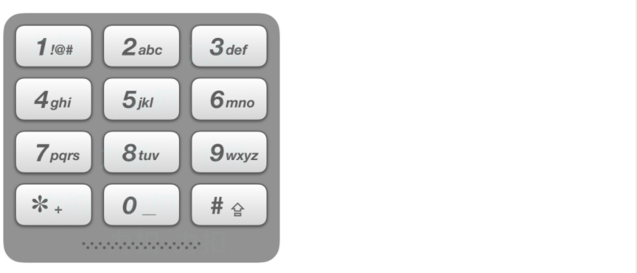

# 回溯算法

## 1.回溯算法理论基础

作为纯暴力搜索，可以解决如下问题：

1. 组合问题

   组合是无序的。

2. 切割问题

3. 子集问题

4. 排列问题

   排列是有序的。

5. 棋盘问题


一般的伪代码：

```c++
void backTracking(para list)
{
    if (终止条件)
    {
        收集结果
        return;
    }
    for (集合的元素集)
    {
        处理节点
        递归函数
        回溯操作
    }
    return;
}
```


### 回溯三部曲

1. 递归函数的参数和返回值
2. 递归函数的终止条件
3. 确定单层搜索的逻辑


## 2/3.组合问题/组合优化

### 77. 组合（中等）

**题目：**

给定两个整数 n 和 k，返回 1 ... n 中所有可能的 k 个数的组合。


**解法：**

```c++
class Solution {
public:
    vector<vector<int>> combine(int n, int k) {
        // 定义两个容器
        vector<int> path;
        vector<vector<int>> result;
        // 递归调用
        backTracking(path, result, n, k, 1);
        return result;
    }
    
    void backTracking(vector<int> &path, vector<vector<int>> &result, int n, int k, int startIndex)
    {
        // 找到符合条件的结果
        if (path.size() == k)
        {
            // 将符合条件的结果记录下来
            result.push_back(path);
            return;
        }
        // 其实符合条件的集合位置最多到n - (k - path.size()) + 1，再往后就没必要遍历
        // for (int i = startIndex; i <= n - (k - path.size()) + 1; i++)
        for (int i = startIndex; i <= n; i++)
        {
            // 记录遍历的元素
            path.push_back(i);
            // 进行递归
            backTracking(path, result, n, k, i + 1);
            // 回溯弹出尾部数据
            path.pop_back();
        }
    }
};
```


### 216. 组合总和III（中等）

题目：

找出所有相加之和为 n 的 k 个数的组合。组合中只允许含有 1 - 9 的正整数，并且每种组合中不存在重复的数字。


解法：

```c++
class Solution {
private:
    vector<vector<int>> result; // 存放结果集
    vector<int> path; // 符合条件的结果
    // targetSum：目标和，也就是题目中的n。
    // k：题目中要求k个数的集合。
    // sum：已经收集的元素的总和，也就是path里元素的总和。
    // startIndex：下一层for循环搜索的起始位置。
    void backtracking(int targetSum, int k, int sum, int startIndex) {
        // 从元素和的角度来剪枝
        if (sum > targetSum) return;  // 如果子集和大于目标和直接返回
        if (path.size() == k) {
            if (sum == targetSum) result.push_back(path);
            return; // 如果path.size() == k 但sum != targetSum 直接返回
        }
        // 从元素个数的角度来剪枝
        for (int i = startIndex; i <= 9 - k + path.size() +1; i++)
        // for (int i = startIndex; i <= 9; i++) {
            sum += i; // 处理
            path.push_back(i); // 处理
            backtracking(targetSum, k, sum, i + 1); // 注意i+1调整startIndex
            sum -= i; // 回溯
            path.pop_back(); // 回溯
        }
    }

public:
    vector<vector<int>> combinationSum3(int k, int n) {
        backtracking(n, k, 0, 1);
        return result;
    }
};
```


### 17. 电话号码的字母组合（中等）

题目：

给定一个仅包含数字 2-9 的字符串，返回所有它能表示的字母组合。

给出数字到字母的映射如下（与电话按键相同）。注意 1 不对应任何字母。




解法：

```c++
class Solution {
public:
    vector<string> letterCombinations(string digits) {
        if (digits.size() == 0) return result;
        backTracking(digits, 0);
        return result;
    }

private:
    const string letterMap[10] = {
        "", // 0
        "", // 1
        "abc", // 2
        "def", // 3
        "ghi", // 4
        "jkl", // 5
        "mno", // 6
        "pqrs", // 7
        "tuv", // 8
        "wxyz", // 9
    };

    string path;
    vector<string> result;

    void backTracking(const string &digits, int index)
    {
        if (index == digits.size())  // 树的宽度，从index = 0开始到index = 数组size结束
        {
            result.push_back(path);  // 收集结果子集
            return;  // 跳出当前递归
        }
        int digit = digits[index] - '0';  // char转换为int
        string letters = letterMap[digit];  // 取出对应字符集
        for (int i = 0; i < letters.size(); i++)  // 遍历字符集里的每一个元素
        {
            path.push_back(letters[i]);  // 收集元素
            backTracking(digits, index + 1);  // 递归
            path.pop_back();  // 到叶子节点收集结果后，进行回溯
        }
    }
};
```

