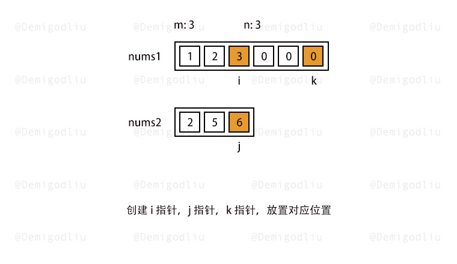

# 参考资料

面试常考题：[幕布](https://mubu.com/doc/7jiBYKCKqet)


## 1. 数据结构篇

### 1.数组

#### 88. 合并两个有序数组（简单）

**题目：**

给你两个按 非递减顺序 排列的整数数组 `nums1` 和 `nums2`，另有两个整数 m 和 n ，分别表示 `nums1` 和` nums2` 中的元素数目。

请你 合并 `nums2` 到 `nums1` 中，使合并后的数组同样按 非递减顺序 排列。



**解题思路：**

1. 扩充`nums1`到两个数组合并后的大小，利用从后往前的方法，这样就不用担心遍历`nums1`之前覆盖掉它的数
2. 定义三个指针，分别从三个尾部开始
3. 开始对比`i`和`j`对应的数值大小，出现四种情况，`i`对应的更大；`j`对应的更大或相同；`i`遍历完了；`j`遍历完了
4. 对应这四种情况，分别用一个辅助指针`k`去记录需要更新的数值
5. 再每一次比对和记录之后别忘了更新指针，前移

```c++
class Solution {
public:
    void merge(vector<int>& nums1, int m, vector<int>& nums2, int n) {
        // 初始化两个辅助指针
        int p1 = m - 1, p2 = n - 1;
        // 初始化记录合并之后的数组大小
        int merge = m + n -1;
        // 定义一个辅助指针
        int cur;
        while (p1 >= 0 || p2 >= 0)  // 遍历完两个数组之后，结束循环
        {
            if (p1 == -1)
            {
                // nums1已经遍历完了,接下来只要操作nums2了
                cur = nums2[p2--];
            }
            else if (p2 == -1)
            {
                // nums2已经遍历完了,接下来只要操作nums3了
                cur = nums1[p1--];
            }
            else if (nums1[p1] > nums2[p2])
            {
                // nums1记录的更大，就把更大的数利用辅助指针记录下来
                cur = nums1[p1--];
            }
            else
            {
                // nums2的更大或者两者相同，就记录nums2的
                cur = nums2[p2--];
            }
            // 更新记录的数到合并数组里，并更新指针
            nums1[merge--] = cur;
        }
    }
};
```

#### 240. 搜索二维矩阵II（中等）

编写一个高效的算法来搜索 `m x n `矩阵 `matrix `中的一个目标值 `target `。该矩阵具有以下特性：

每行的元素从左到右升序排列。
每列的元素从上到下升序排列。

**参考思路：**

[力扣](https://leetcode.cn/problems/search-a-2d-matrix-ii/solution/sou-suo-er-wei-ju-zhen-ii-cong-you-shang-e0vj/)

**解题思路：**


利用这种矩阵的这个特性：

x左边的一定比x小，x下面的一定比x大，这样就可以根据目标值和x进行比对，排除行或列

```c++
class Solution {
public:
    bool searchMatrix(vector<vector<int>>& matrix, int target) {
        if (!matrix.size() && !matrix[0].size()) return false;
        // 初始化指针到矩阵的右上角
        int i = 0, j = matrix[0].size() - 1;
        // 当i小于矩阵行数且j大于等于0的时候继续循环
        while (i < matrix.size() && j >= 0)
        {
            // 找到目标
            if (matrix[i][j] == target) return true;
            // 右上角的值小于目标值，则说明当前这一行的值都要小于目标值，剔除行
            else if (matrix[i][j] < target) i++;
            // 右上角的值大于目标值，则说明当前这一列的值都要大于，剔除列
            else if (matrix[i][j] >target) j--;
        }
        return false;
    }
};
```


#### 48. 旋转矩阵
