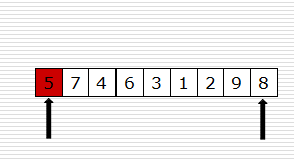

# 常见算法

## 1. 归并排序`MergeSort`

### 动图演示


### 代码实现

```c++
void Merge(std::vector<int>& Array, int front, int mid, int end) {
  // 1.分成两个子序列
  std::vector<int> leftSubArray(Array.begin() + front, Array.begin() + mid + 1);
  std::vector<int> rightSubArray(Array.begin() + mid + 1, Array.begin() + end + 1);
  int idxLeft = 0, idxRight = 0;
  // 2.给两个子序列末尾插入最大值，保证实际的所有值都能遍历到
  leftSubArray.insert(leftSubArray.end(), numeric_limits<int>::max());
  rightSubArray.insert(rightSubArray.end(), numeric_limits<int>::max());
  // 3.依次保存两个子序列里的更小值
  for (int i = front; i <= end; ++i) {
    if (leftSubArray[idxLeft] < rightSubArray[idxRight]) {
      Array[i] = leftSubArray[idxLeft++];
    } else {
      Array[i] = rightSubArray[idxRight++];
    }
  }
}

void MergeSort(std::vector<int>& Array, int front, int end) {
  if (front >= end) return;
  int mid = (front + end) / 2;
  MergeSort(Array, front, mid);
  MergeSort(Array, mid + 1, end);
  Merge(Array, front, mid, end);
}
```


## 2. 快速排序`QuickSort`

### 动图演示



### 代码实现

```c++
int Paritition(std::vector<int>& Array, int low, int high) {
  // 1.选取Array[low]为基准元素
  int pivot = Array[low];
  while (low < high) {
    // 2.先从右边开始，找第一个小于pivot的值
    while (low < high && Array[high] >= pivot) {
      --high;
    }
    // 3.将其移动到左边，与pivot换位置
    Array[low] = Array[high];
    // 4.再从左边开始，找地一个大于pivot的值
    while (low < high && Array[low] <= pivot) {
      ++low;
    }
    // 5.将其移动到右边，与pivot换位置
    Array[high] = Array[low];
  }  // 不断重复这个过程，直到low和high相遇
  // 6.将pivot放置到相遇的位置，返回相遇的位置作为基准元素的最终位置
  Array[low] = pivot;
  return low;
}

void QuickSort(std::vector<int>& Array, int low, int high) {
  if (low < high) {
    int pivot = Paritition(Array, low, high);
    QuickSort(Array, low, pivot - 1);
    QuickSort(Array, pivot + 1, high);
  }
}
```

### 扩展 - 找到第K大的数就返回

```c++
int Paritition(std::vector<int>& Array, int low, int high) {
  // 1.选取Array[low]为基准元素
  int pivot = Array[low];
  while (low < high) {
    // 2.先从右边开始，找第一个小于pivot的值
    while (low < high && Array[high] >= pivot) {
      --high;
    }
    // 3.将其移动到左边，与pivot换位置
    Array[low] = Array[high];
    // 4.再从左边开始，找地一个大于pivot的值
    while (low < high && Array[low] <= pivot) {
      ++low;
    }
    // 5.将其移动到右边，与pivot换位置
    Array[high] = Array[low];
  }  // 不断重复这个过程，直到low和high相遇
  // 6.将pivot放置到相遇的位置，返回相遇的位置作为基准元素的最终位置
  Array[low] = pivot;
  return low;
}

int QuickSelect(std::vector<int>& Array, int low, int high, int target) {
  // 1.终止条件
  if (low == high) {
    return Array[low];
  }

  // 第K大元素的索引是N - K
  // 快排逻辑
  // 基准值左边的数都要更小，右边的数都要更大
  // 如果基准值索引更大，说明右边有超过N-K个元素比基准值小，虽然这些元素可能是乱序的，但第K大元素就在其中
  // 如果基准值索引更小，则相反

  // 2.返回基准值索引，其左边的元素都小于基准值，右边相反
  int pivotIndex = Paritition(Array, low, high);
  // 3.如果基准值索引等于数组个数 - K，即target，说明基准就是目标数
  // eg:  1, 2, 3, 4   找第2(K)大的数，那么就是3,刚好索引是数组个数 - K
  if (target == pivotIndex) return Array[pivotIndex];
  // 4.如果基准值索引更大，说明左边的
  else if (target < pivotIndex)
    return QuickSelect(Array, low, pivotIndex - 1, target);
  else
    return QuickSelect(Array, pivotIndex + 1, high, target);
}
```

