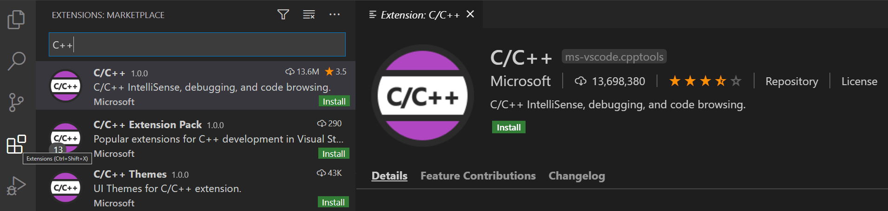

# Linux环境配置

***参考链接:*** 

Visual Studio Code官方文档->https://code.visualstudio.com/docs/cpp/config-linux

ubuntu 20.04 + gcc 9.4.0 

## 准备工作

1. 安装vscode-->https://code.visualstudio.com/download
2. 安装c++插件



3. 安装gcc，一般ubuntu系统会自带gcc、g++

```bash
# 1. 检查是否有gcc，试过了9.4.0的版本，没有问题
gcc -v

# 2. 如果未安装，先更新软件库
sudo apt-get update

# 3. 下载gcc,g++,gdb
sudo apt-get install gcc
sudo apt-get install g++
sudo apt-get install gdb

# 4.检查
gcc --version
g++ --version
```


## Run配置

1. 在vscode中创建一个项目`test_vscode`，并在其中建立一个`src/main.cpp`源文件

```bash
# 目录如下
test_vscode
     |-----src
     		|-----main.cpp
```

写入测试代码: 

```c++
#include<iostream>
using namespace std;

int main()
{
    cout << "1" << endl;
}
```

2. 点击右上角的`Run c/c++ file`，选择`g++ build and debug active file` ，运行`main.cpp`


3. vscode会自动生成`tasks.json`***（重点）***

```json
{
    "tasks": [
        {
            "type": "cppbuild",
            "label": "C/C++: g++ build active file",
            "command": "/usr/bin/g++",
            "args": [
                "-fdiagnostics-color=always",
                "-g",
                "${file}",  // 运行的当前文件
                "-o",
                "${fileDirname}/${fileBasenameNoExtension}"  // 输出的二进制文件
            ],
            "options": {
                "cwd": "${fileDirname}"
            },
            "problemMatcher": [
                "$gcc"
            ],
            "group": "build",
            "detail": "Task generated by Debugger."
        }
    ],
    "version": "2.0.0"
}
```

其中`args`为参数列表，

可以在`-g`中添加一并需要运行的源文件，比如函数实现的源文件，

创建一个`execute/test.cpp`: 

```c++
#include"test.h"

void Test::printTest()
{
    cout << "函数声明和函数实现分写测试" << endl;
}
```

也可以添加`-I`，比如加入函数声明头文件所在的文件夹，

创建一个`include/test.h`: 

```c++
#pragma once
#include<iostream>
using namespace std;

class Test
{
    public:
    void printTest();
};
```

修改`tasks.json`中的`args`，类似: 

```json
"args": [
    "-fdiagnostics-color=always",
    "-g",
    "${file}",
    "${workspaceFolder}/execute/*.cpp",  // 源文件地址
    "-I",
    "${workspaceFolder}/include",   // 头文件地址
    "-o",
    "${fileDirname}/${fileBasenameNoExtension}"
]
```

再修改`main.cpp`，

```c++
#include<iostream>
using namespace std;
#include"test.h"

int main()
{
    Test t1;
    t1.printTest();
    cout << "1" << endl;
}
```

点击`Run C/C++ file`或者`F5`运行得到: 


## Debug配置

在完成**Run配置**之后已经可以初步调试了，vscode会自动创建一个临时的debug配置，

如果想额外进行自定义调试，可以利用`launch.json`文件。


### 配置方法

点击右上角`Add Debug Configuration`，选择`g++ build and debug active file` ，


自动生成`launch.json`，类似:

```json
{
    "configurations": [
        {
            "name": "C/C++: g++ build and debug active file",
            "type": "cppdbg",
            "request": "launch",
            "program": "${fileDirname}/${fileBasenameNoExtension}",
            "args": [],
            "stopAtEntry": false,
            "cwd": "${fileDirname}",
            "environment": [],
            "externalConsole": false,
            "MIMode": "gdb",
            "setupCommands": [
                {
                    "description": "Enable pretty-printing for gdb",
                    "text": "-enable-pretty-printing",
                    "ignoreFailures": true
                },
                {
                    "description": "Set Disassembly Flavor to Intel",
                    "text": "-gdb-set disassembly-flavor intel",
                    "ignoreFailures": true
                }
            ],
            "preLaunchTask": "C/C++: g++ build active file",
            "miDebuggerPath": "/usr/bin/gdb"
        }
    ],
    "version": "2.0.0"
}
```


### 配置修改

1. 修改`externalConsole`为`ture`，Run或Debug会在系统自带的终端中显示

```json
"externalConsole": true,
```


# Windows环境配置

*参考博客：[vscode blog](https://code.visualstudio.com/docs/cpp/config-mingw#_create-hello-world)*

*版本：win11*

## 准备工作

1. 安装vscode
2. 安装vscode中的c++插件
3. 安装[MSYS2](https://www.msys2.org/)，默认安装即可
4. 安装相关的工具包，用这个命令：`pacman -S --needed base-devel mingw-w64-x86_64-toolchain`
5. 添加环境变量：

利用`win + s`来搜索环境变量的修改页面，如图所示，对`Path`进行添加：


如果是默认安装的MSYS2，就添加`C:\msys64\mingw64\bin`即可。

最后检查一下：

```bash
gcc --version
g++ --version
gdb --version
```


## Run配置

**（这里大部分可以参考Linux下的配置步骤）**

1. 创建一个测试项目

```bash
mkdir projects
cd projects
mkdir helloworld
cd helloworld
code .
```

2. 建一个`.cpp`文件，写入测试代码

```c++
#include <iostream>
#include <vector>
#include <string>

using namespace std;

int main()
{
    vector<string> msg {"Hello", "C++", "World", "from", "VS Code", "and the C++ extension!"};

    for (const string& word : msg)
    {
        cout << word << " ";
    }
    cout << endl;
}
```

3. 点击右上角的`Run C/C++ File`，选择`C/C++: g++.exe build and debug active file`，然后会自动运行并生成配置文件，如下所示：

```json
{
    "tasks": [
        {
            "type": "cppbuild",
            "label": "C/C++: g++.exe build active file",
            "command": "C:\\msys64\\mingw64\\bin\\g++.exe",
            "args": [
                "-fdiagnostics-color=always",
                "-g",
                "${file}",
                "-o",
                "${fileDirname}\\${fileBasenameNoExtension}.exe"
            ],
            "options": {
                "cwd": "${fileDirname}"
            },
            "problemMatcher": [
                "$gcc"
            ],
            "group": {
                "kind": "build",
                "isDefault": true
            },
            "detail": "Task generated by Debugger."
        }
    ],
    "version": "2.0.0"
}
```

4. 根据Linux的Run配置，进行分文件编写的配置，主要就是添加`args`

```json
"args": [
    "-fdiagnostics-color=always",
    "-g",
    "${file}",
    "${workspaceFolder}\\execute\\*.cpp",  // 源文件地址
    "-I",
    "${workspaceFolder}\\include",   // 头文件地址
    "-o",
    "${fileDirname}\\${fileBasenameNoExtension}.exe"
],
```


## Debug配置

完成Run配置之后，已经能初步调试了。

接下来进行自定义调试

### 配置方法

1. 点击右上角的`Add Debug Configuration`，选择` C/C++: g++.exe build and debug active file`，生成`launch.json`

```json
{
    "configurations": [
        {
            "name": "C/C++: g++.exe build and debug active file",
            "type": "cppdbg",
            "request": "launch",
            "program": "${fileDirname}\\${fileBasenameNoExtension}.exe",
            "args": [],
            "stopAtEntry": false,
            "cwd": "${fileDirname}",
            "environment": [],
            "externalConsole": false,
            "MIMode": "gdb",
            "miDebuggerPath": "C:\\msys64\\mingw64\\bin\\gdb.exe",
            "setupCommands": [
                {
                    "description": "Enable pretty-printing for gdb",
                    "text": "-enable-pretty-printing",
                    "ignoreFailures": true
                },
                {
                    "description": "Set Disassembly Flavor to Intel",
                    "text": "-gdb-set disassembly-flavor intel",
                    "ignoreFailures": true
                }
            ],
            "preLaunchTask": "C/C++: g++.exe build active file"
        }
    ],
    "version": "2.0.0"
}
```


### 配置修改

1. 修改`externalConsole`为`ture`，Run或Debug会在系统自带的终端中显示

```json
"externalConsole": true,
```


### 问题

1. **在Windows下设置自带终端显示会直接自动关闭，显示不出来。**

这里是因为没有添加：

```c++
system("pause");
return 0;
```

window下的终端没自带按任意键关闭的功能。


2. **window自带终端显示出来的中文是乱码的。**

这是因为vscode默认是utf-8的编码方式，如果在vscode里面修改编码方式之后，就可以正常显示中文了。

**这样修改之后的新情况：**

但这个时候vscode自带的终端又是utf-8，所以在vscode自带的终端上中文又会乱码


3. **分文件编写的时候，源文件里面的中文输出在GBK下一直是乱码**


4. **一个程序还没有结束的时候，运行其他程序会出错**


5. **不能中文命名运行文件**
